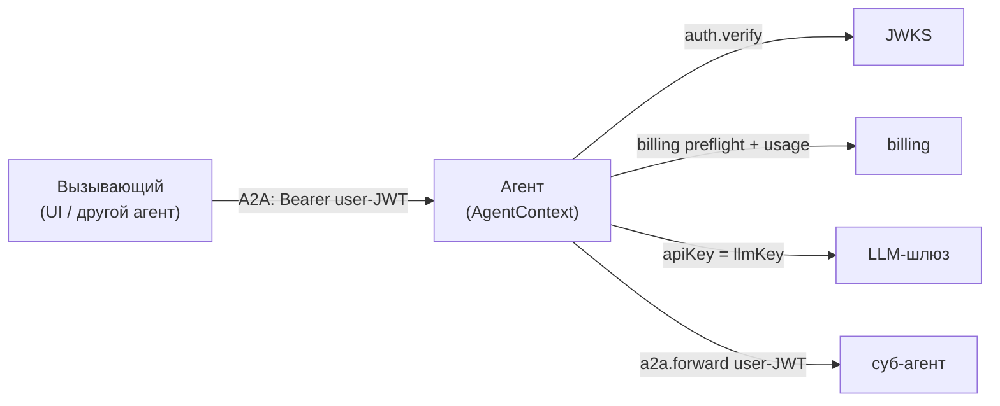
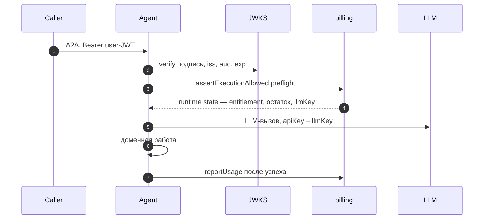

# ai37-agent-sdk

SDK для **агентов** экосистемы **AI37**. Закрывает четыре сквозные задачи, которые иначе каждый агент
реализует по-своему:

- **auth** — верификация входящего **user-JWT** по JWKS (issuer/audience/exp, кэш ключей);
- **billing** — runtime state + metered usage через billing-сервис (entitlement, остаток токенов,
  ключ LLM-шлюза `llmKey`);
- **a2a** — **forward** того же user-JWT при вызове другого агента по A2A;
- **AgentContext** — sugar над auth+billing (verify → preflight → usage);
- **testing kit** — фейки, фикстуры и тест-токены, чтобы агенты тестировались без внешних сервисов.

Монорепо, две реализации с **общим контрактом** (`contract/`), идентичные по именам и семантике:

| Пакет | Реестр | Путь | Статус |
|---|---|---|---|
| `@ai37/agent-sdk` | npm | `packages/ts` | реализован: auth, billing, a2a, AgentContext, testing, CLI |
| `ai37-agent-sdk` | PyPI | `packages/python` | реализован: auth, billing, a2a, AgentContext, testing (CLI — follow-up) |

> **Это resource-server / agent SDK.** Он *проверяет* и *форвардит* уже выданный токен, но **не
> выполняет OIDC-логин** (Authorization Code + PKCE, обмен code, refresh, сессия) — это сторона
> клиента/UI. Host-слой агента (HTTP + A2A + AG-UI) — отдельный пакет `@ai37/agent-host`.

## Где SDK в работе агента



| Что делает агент | Модуль SDK |
|---|---|
| Проверить входящий JWT + биллинг (preflight/usage) | **`AgentContext`** (auth + billing) |
| Вызвать другого агента по A2A (forward токена) | **`a2a`** (`buildA2AAuthHeaders` / `forwardAuthFetch`) |
| LLM-вызов оплачиваемой моделью | `llmKey` из runtime state → apiKey к LLM-шлюзу |
| Тесты без сети | **`testing`** (фейки/фикстуры/токены) |

## Типичный поток агента



## Установка

```bash
# TypeScript (Node ≥ 22)
npm i @ai37/agent-sdk
# Python (≥ 3.11)
pip install ai37-agent-sdk     # или: poetry add ai37-agent-sdk
```

## Быстрый старт (агент): verify + billing одной обёрткой

```ts
import { AgentContext } from "@ai37/agent-sdk";

const ctx = await AgentContext.fromRequest(headers, {
  auth: { issuer, audience, jwksUrl, required: true },
  billing: { baseUrl: BILLING_BASE_URL },
});
const state = await ctx.assertExecutionAllowed({ feature, privilege }); // отказ → исключение
// LLM-агент:     const apiKey = ctx.llmKey;
// metered-агент: await ctx.reportUsage({ transactionId: task.id, code, properties });
```

```python
from ai37_agent_sdk import AgentContext, AgentContextSettings, AuthSettings, BillingSettings

ctx = AgentContext.from_request(headers, AgentContextSettings(
    auth=AuthSettings(issuer=ISSUER, audience=AUDIENCE, jwks_url=JWKS_URL, required=True),
    billing=BillingSettings(base_url=BILLING_BASE_URL),
))
state = ctx.assert_execution_allowed(feature=..., privilege=...)
# LLM-агент:     api_key = ctx.llm_key
# metered-агент: ctx.report_usage(transaction_id=task_id, code="...", properties={...})
```

## Вызов другого агента (forward user-JWT)

Когда агент сам зовёт суб-агента по A2A — прокидывает тот же user-JWT:

```ts
import { buildA2AAuthHeaders } from "@ai37/agent-sdk";
const res = await fetch(subAgentUrl, { headers: buildA2AAuthHeaders(userJwt) });
```

```python
from ai37_agent_sdk import build_a2a_auth_headers
headers = build_a2a_auth_headers(user_jwt)
```

## Тестирование агента без сети

Подпакет `@ai37/agent-sdk/testing` / `ai37_agent_sdk.testing` — чтобы агенты не изобретали моки.

```ts
import { makeTestContext, InMemoryBillingClient, fixtures } from "@ai37/agent-sdk/testing";
const ctx = await makeTestContext({
  claims: { sub: "u1", org_id: "u1", billing_org_id: "org1", app_id: "product-a" },
  billing: new InMemoryBillingClient({ runtimeState: fixtures.runtimeState.active() }),
});
```

```python
from ai37_agent_sdk.testing import make_test_context, InMemoryBillingClient, fixtures
ctx = make_test_context(
    claims={"sub": "u1", "org_id": "u1", "billing_org_id": "org1"},
    billing=InMemoryBillingClient(runtime_state=fixtures.runtime_state.no_resources()),
)
```

- **Уровень 1 (юнит):** `FakeJwtVerifier` + `InMemoryBillingClient` + `fixtures` — без сети.
- **Уровень 2a (реальная подпись):** `createTestKeyset()/makeTestToken()/testJwks()` — verify по
  настоящему RSA-keypair, без внешнего провайдера.

## Модули и публичный API

| Модуль | TS (`@ai37/agent-sdk`) | Python (`ai37_agent_sdk`) |
|---|---|---|
| **auth** | `JwksJwtVerifier`, `createJwtVerifier`, `extractBearer`, `Claims`, `AuthError` | `JwksJwtVerifier`, `create_jwt_verifier`, `extract_bearer`, `Claims`, `AuthError` |
| **billing** | `createBillingClient`, `BillingClient`, `BillingRuntimeState`, `hasRequiredAccess`, ошибки | `create_billing_client`, `BillingClient`, `BillingRuntimeState`, `has_required_access`, ошибки |
| **a2a** | `buildA2AAuthHeaders`, `forwardAuthFetch`, `A2A_PROTOCOL_VERSION` | `build_a2a_auth_headers`, `A2A_PROTOCOL_VERSION` |
| **AgentContext** | `.fromRequest`, `.assertExecutionAllowed`, `.reportUsage`, `.llmKey` | `.from_request`, `.assert_execution_allowed`, `.report_usage`, `.llm_key` |
| **codes** | `BillingFeatureCode`, `BillingPrivilegeCode` | `BillingFeatureCode`, `BillingPrivilegeCode` |
| **testing** | `FakeJwtVerifier`, `InMemoryBillingClient`, `fixtures`, `makeTestContext`, `createTestKeyset` | `FakeJwtVerifier`, `InMemoryBillingClient`, `fixtures`, `make_test_context`, `create_test_keyset` |

## Вне scope

- **OIDC-логин (Relying Party):** Authorization Code + PKCE, обмен code, refresh, сессия — сторона
  клиента/UI. SDK только *проверяет* и *форвардит* уже выданный токен.
- **Token-exchange / делегированные токены** — не реализуем (forward того же user-JWT).
- **Host-слой агента** (HTTP + A2A + AG-UI) — пакет `@ai37/agent-host` поверх этого SDK.

## Безопасность

Никогда не логировать секреты: `Authorization`, `llmKey`, `authToken`. Ключ LLM-шлюза берётся
**только** из runtime state (preflight), не из JWT/тела.

## Контракт и разработка

- **Контракт (источник истины):** [`contract/`](contract/) — claims, runtime state, feature-codes,
  env. Кодоген `codes` в оба пакета: `make codegen`.

```bash
make codegen     # contract/feature-codes.json → codes.ts + codes.py
make ts          # сборка/тесты TS-пакета
make py          # сборка/тесты Python-пакета (Python 3.11+ / poetry)
make verify      # codegen-парити + оба пакета
```

Статус: **0.1.0-alpha**.
