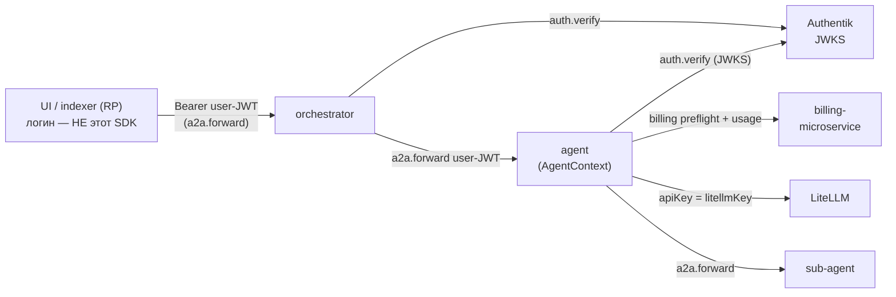
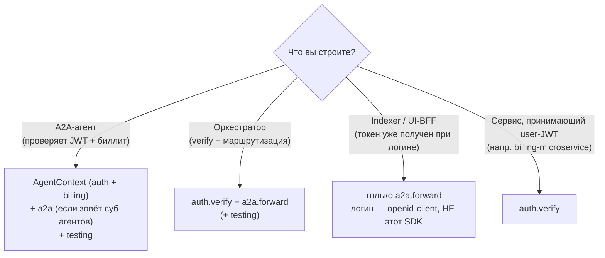

# ai37-agent-sdk

SDK для сервисов экосистемы **AI37**. Закрывает четыре сквозные задачи, которые иначе каждый агент,
оркестратор и бэкенд реализуют по-своему:

- **auth** — верификация входящего **user-JWT** Authentik по JWKS (issuer/audience/exp, кэш ключей);
- **billing** — runtime state + metered usage через billing-microservice (entitlement, остаток
  токенов, `litellmKey`);
- **a2a** — **forward** того же user-JWT при вызове другого агента по A2A;
- **AgentContext** — sugar над auth+billing для агентов (verify → preflight → usage);
- **testing kit** — фейки, фикстуры и тест-токены, чтобы агенты тестировались без Authentik/billing.

Монорепо, две реализации с **общим контрактом** (`contract/`), идентичные по именам и семантике:

| Пакет | Реестр | Путь | Статус |
|---|---|---|---|
| `@ai37/agent-sdk` | npm | `packages/ts` | реализован: auth, billing, a2a, AgentContext, testing, CLI |
| `ai37-agent-sdk` | PyPI | `packages/python` | реализован: auth, billing, a2a, AgentContext, testing (CLI — follow-up) |

> **Это resource-server / agent SDK, а не OIDC Relying Party.** Он *проверяет* и *форвардит* токены,
> но **не делает OIDC-логин** (Authorization Code + PKCE, обмен code, refresh, сессия). Для логина в
> UI/indexer используйте RP-библиотеку (`openid-client` и т.п.) — см. [«Что вне scope»](#что-вне-scope).

## Где SDK в потоке запроса

Каждый актор использует свой набор модулей. Логин (UI/indexer как RP) — вне SDK.



## Какую часть использовать (по ситуации)



| Что вы делаете | Используйте | Обычно НЕ нужно |
|---|---|---|
| A2A-агент (verify входящего JWT + биллинг) | `AgentContext` (auth+billing); `a2a` при суб-вызовах; `testing` | — |
| Оркестратор (verify + forward вниз) | `auth` (verify), `a2a` (forward); `testing` | `billing` (у оркестратора обычно `none`) |
| Indexer / UI-BFF (токен уже есть, зовёт downstream) | `a2a` (forward) | `auth`/`billing` — verify делает downstream |
| Сервис, принимающий user-JWT | `auth` (verify) | `a2a` |
| Тесты любого из перечисленного | `testing` (фейки/фикстуры/токены) | — |

## Типичный поток агента (AgentContext)

```mermaid
sequenceDiagram
  autonumber
  participant C as Caller (UI/оркестратор)
  participant A as Agent (AgentContext)
  participant AK as Authentik JWKS
  participant B as billing-microservice
  participant L as LiteLLM
  C->>A: A2A, Authorization: Bearer user-JWT
  A->>AK: verify подпись/iss/aud/exp (кэш по kid)
  A->>B: assertExecutionAllowed (preflight)
  B-->>A: runtime state (entitlement, остаток, litellmKey)
  alt LLM-агент
    A->>L: LLM-вызов (apiKey = litellmKey)
  end
  A->>A: доменная работа
  A->>B: reportUsage (metered, после успеха; идемпотентно по task.id)
```

## Модули и публичный API

| Модуль | TS (`@ai37/agent-sdk`) | Python (`ai37_agent_sdk`) | Назначение |
|---|---|---|---|
| **auth** | `JwksJwtVerifier`, `createJwtVerifier`, `extractBearer`, `Claims`, `AuthError` | `JwksJwtVerifier`, `create_jwt_verifier`, `extract_bearer`, `Claims`, `AuthError` | verify user-JWT по JWKS; достать Bearer; claims |
| **billing** | `createBillingClient`, `BillingClient`, `BillingRuntimeState`, `hasRequiredAccess`, ошибки | `create_billing_client`, `BillingClient`, `BillingRuntimeState`, `has_required_access`, ошибки | runtime state + metered usage; `litellmKey` внутри state |
| **a2a** | `buildA2AAuthHeaders`, `forwardAuthFetch`, `A2A_PROTOCOL_VERSION` | `build_a2a_auth_headers`, `A2A_PROTOCOL_VERSION` | forward user-JWT + `A2A-Version` вниз по цепочке |
| **AgentContext** | `AgentContext.fromRequest`, `.assertExecutionAllowed`, `.reportUsage`, `.litellmKey` | `AgentContext.from_request`, `.assert_execution_allowed`, `.report_usage`, `.litellm_key` | sugar: verify → billing client (forward-token) → preflight/usage |
| **codes** | `BillingFeatureCode`, `BillingPrivilegeCode` | `BillingFeatureCode`, `BillingPrivilegeCode` | коды фич/привилегий (кодоген из контракта) |
| **testing** | `FakeJwtVerifier`, `InMemoryBillingClient`, `fixtures`, `makeTestContext`, `createTestKeyset`/`makeTestToken`/`testJwks` | `FakeJwtVerifier`, `InMemoryBillingClient`, `fixtures`, `make_test_context`, `create_test_keyset`/`make_test_token`/`test_jwks` | юнит-тесты без сети + Уровень 2a (реальная подпись) |

## Установка

```bash
# TypeScript (Node ≥ 22)
npm i @ai37/agent-sdk
# Python (≥ 3.11)
pip install ai37-agent-sdk     # или: poetry add ai37-agent-sdk
```

## Быстрый старт

### Агент — verify + billing одной обёрткой

```ts
import { AgentContext } from "@ai37/agent-sdk";

const ctx = await AgentContext.fromRequest(headers, {
  auth: { issuer, audience, jwksUrl, required: true },
  billing: { baseUrl: BILLING_BASE_URL },
});
const state = await ctx.assertExecutionAllowed({ feature, privilege }); // 403 при отказе
// LLM-агент:    const apiKey = ctx.litellmKey;
// metered-агент: await ctx.reportUsage({ transactionId: task.id, code, properties });
```

```python
from ai37_agent_sdk import AgentContext, AgentContextSettings, AuthSettings, BillingSettings

ctx = AgentContext.from_request(headers, AgentContextSettings(
    auth=AuthSettings(issuer=ISSUER, audience=AUDIENCE, jwks_url=JWKS_URL, required=True),
    billing=BillingSettings(base_url=BILLING_BASE_URL),
))
state = ctx.assert_execution_allowed(feature=..., privilege=...)
```

### Forward user-JWT вниз (оркестратор / indexer)

```ts
import { buildA2AAuthHeaders } from "@ai37/agent-sdk";
const res = await fetch(agentUrl, { headers: buildA2AAuthHeaders(userJwt) });
```

```python
from ai37_agent_sdk import build_a2a_auth_headers
headers = build_a2a_auth_headers(user_jwt)
```

## Тестирование агентов без Authentik/billing

Подпакет `@ai37/agent-sdk/testing` / `ai37_agent_sdk.testing` — чтобы агенты не изобретали моки.

```ts
import { makeTestContext, InMemoryBillingClient, fixtures } from "@ai37/agent-sdk/testing";
const ctx = await makeTestContext({
  claims: { sub: "u1", org_id: "u1", billing_org_id: "org1", app_id: "sp-ai" },
  billing: new InMemoryBillingClient({ runtimeState: fixtures.runtimeState.active() }),
});
```

```python
from ai37_agent_sdk.testing import make_test_context, InMemoryBillingClient, fixtures
ctx = make_test_context(
    claims={"sub": "u1", "org_id": "u1", "billing_org_id": "org1"},
    billing=InMemoryBillingClient(runtime_state=fixtures.runtime_state.no_resources()),
)
```

- **Уровень 1 (юнит):** `FakeJwtVerifier` + `InMemoryBillingClient` + `fixtures` — без сети.
- **Уровень 2a (реальная подпись):** `createTestKeyset()/makeTestToken()/testJwks()` — verify по
  настоящему RSA-keypair, без Authentik.

Подробно — [docs TESTING.md](../docs/projects/ai37-agent-sdk/TESTING.md).

## Что вне scope

- **OIDC-логин (Relying Party):** Authorization Code + PKCE, обмен code на токены, refresh, сессия —
  это задача UI/indexer; берите `openid-client` или auth слой фреймворка. SDK только *проверяет* и
  *форвардит* уже выданный токен.
- **Token-exchange / делегированные токены** — не реализуем (forward того же user-JWT, РЕШЕНИЕ 2).
- **Host-слой агента** (Express/FastAPI + A2A + AG-UI) — отдельный пакет `@ai37/agent-host`
  (поверх этого SDK).

## Безопасность

Никогда не логировать секреты: `Authorization`, `litellmKey`, `authToken`. `litellmKey` берётся
**только** из runtime state (preflight), не из JWT/тела.

## Контракт и документация

- **Контракт (источник истины):** [`contract/`](contract/) — `claims.schema.json`,
  `billing-runtime-state.schema.json`, `feature-codes.json`, webhook, `env.md`. Кодоген `codes` в оба
  пакета: `make codegen`.
- **Спецификация / API / тестирование:** `docs/projects/ai37-agent-sdk/`
  ([README](../docs/projects/ai37-agent-sdk/README.md),
  [TESTING](../docs/projects/ai37-agent-sdk/TESTING.md)).

## Разработка

```bash
make codegen     # contract/feature-codes.json → codes.ts + codes.py
make ts          # сборка/тесты TS-пакета
make py          # сборка/тесты Python-пакета (pyenv 3.11+ / poetry)
make verify      # codegen-парити + оба пакета
```

Статус: **0.1.0-alpha** (WP0a + WP0b).
