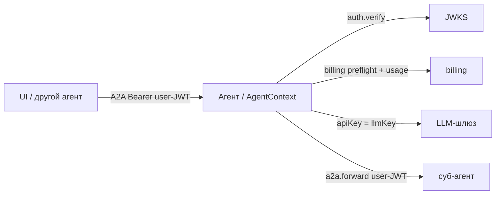
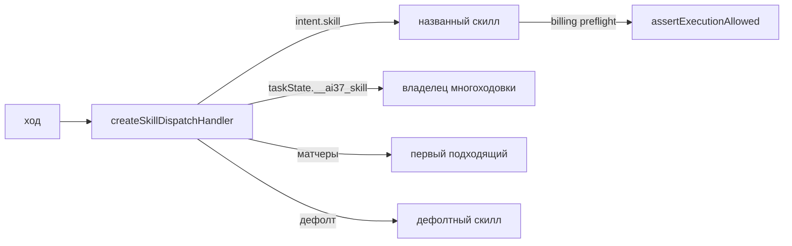
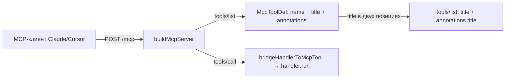
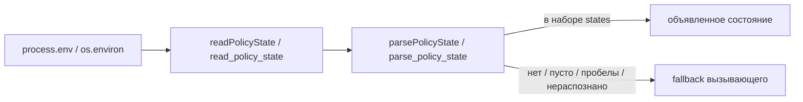
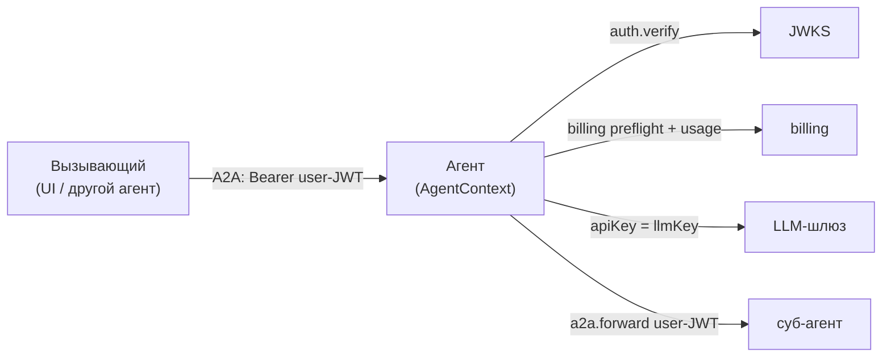

# ai37-agent-sdk

<!-- ai37:card:start (managed by doc-bot — do not edit inside) -->
# ai37-agent-sdk

## Описание

SDK для агентов экосистемы AI37: закрывает сквозные задачи auth (верификация user-JWT по JWKS), billing (runtime state, metered usage, `llmKey`, гейт отказа по `entitlementStatus`, включая `payment_failed`), A2A-forward того же user-JWT и обёртку `AgentContext`. Это монорепо двух реализаций (TypeScript и Python) с общим контрактом, плюс host-слой агентов (`@ai37/agent-host`): поверх SDK хост добавляет A2A/AG-UI/MCP-сервер, JWT-guard, генерик-механизм скиллов (subpath `@ai37/agent-host/skills`) — агент собирается из скиллов (запись карточки, typed I/O, routing-вклад, per-skill биллинг, матчер, handler) — и шов durable LangGraph-чекпоинтера (`AgentHostOptions.checkpointer`, фабрика `createCheckpointer`, accessor `currentCheckpointer()` в turn-scope): durable графовое состояние по `thread_id` как отдельный от A2A task-store уровень. Host сам включает Langfuse-трассировку, но по умолчанию содержимое хода в трейс не пишется: только структура, тайминги, идентификаторы и объёмы. Стриминг в A2A-пути нативный: `AgentEvent.text` уезжает `artifact-update`-дельтами до завершения handler-а, а терминальный Task сохраняет полный канонический ответ. MCP-экспорт агента следует контракту инструмента: у каждого выставленного наружу инструмента обязателен человекочитаемый `title` (не повторяющий `name` и не дублирующий `description`) плюс опциональные хинты поведения (`annotations`). SDK не выполняет OIDC-логин — он проверяет и форвардит уже выданный токен. Плюс общеэкосистемные хелперы: единый разбор политики, объявленной переменной окружения (`policy` / `policy::state`).

## Стек

- TypeScript (Node ≥ 22), npm, tsup (пакет `@ai37/agent-sdk`, текущая версия `0.1.0-alpha.24`).
- Python (≥ 3.11), poetry, ruff, mypy, pytest (пакет `ai37-agent-sdk`, текущая версия `0.1.0a16`).
- Общий контракт в `contract/` (JSON Schema — runtime state и routing/v1, `feature-codes.json`, `env.md`), кодоген `make codegen`. В `feature-codes.json` — коды фич и привилегий биллинга: `daylight-calc-agent`/`daylight-calc-allowed` (Daylight Calculation — расчёт КЕО, парити TS `0.1.0-alpha.22` / Python `0.1.0a14`), `elevator-calc-agent`/`elevator-calc-allowed` (расчёт лифтов), `hvac-air-exchange`/`hvac-air-exchange-allowed` (per-skill код скилла воздухообмена агента ОВиК), `hvac-calc-agent`/`hvac-calc-allowed` (расчёт HVAC; агентский уровень, остаётся фолбэк-гейтом), `hvac-heat-loss`/`hvac-heat-loss-allowed` (per-skill код скилла теплопотерь агента ОВиК), `minstroy-agent`/`minstroy-check-inn`, привилегия `minstroy-price-monitoring` (Minstroy price monitoring), `thermal-calc-agent`/`thermal-calc-allowed` (теплотехнический расчёт), `org-limits` (Organization Limits — источник истины для тарифных лимитов организации) с привилегиями `max-users` (Max Organization Members — лимит участников организации) и `max-api-keys` (Max Active API Keys — лимит активных API-ключей), а также PD-AI: `pdai-doc-152fz`/`pdai-doc-152fz-allowed`, `pdai-doc-187fz`/`pdai-doc-187fz-allowed`, `pdai-site-check`/`pdai-site-check-allowed` (документы 152-ФЗ/187-ФЗ и проверка сайта на соответствие).
- Host-слой: `packages/ts-host` (текущая версия `0.1.0-alpha.43`, subpath `@ai37/agent-host/skills`) и `packages/python-host` (A2A, AG-UI, MCP, Redis task store, observability/Langfuse; версия `0.1.0a15`).
- MCP-экспорт host-слоя: `@modelcontextprotocol/sdk` + `zod` (TS, optional-peer, динамический импорт) и официальный python `mcp` SDK (optional-группа `mcp`, soft-import с `MissingMcpDependencyError`).
- LangGraph-checkpointer: `@langchain/langgraph-checkpoint` (>=1.1.2) и `@langchain/langgraph-checkpoint-postgres` (>=1.0.0) — optional peers host-слоя, импортируются лениво (dynamic import) только при использовании `createCheckpointer`/`checkpointer`.
- `@ai37/docx` — TS-пакет из `packages/ts-docx` (проверяется в CI: `npm run lint`, `npm test`, `npm run build`), публикуется в приватный npm-реестр (см. «Деплой»).

## Схема работы

Агент получает A2A-запрос с Bearer user-JWT; `AgentContext` (SDK):
1. `auth.verify` — проверка подписи/iss/aud/exp по JWKS (кэш ключей) и проверка обязательных claim: набор задаётся опцией `requiredClaims` (TS) / `required_claims` (Python), дефолт — `['sub','org_id','billing_org_id']` (`("sub", "org_id", "billing_org_id")`), то есть поведение существующих верификаторов не меняется. Claim обязаны присутствовать непустой строкой, иначе `AuthError` с кодом `missing_claim`. Набор настраивается, потому что не у всякого субъекта есть организация: платформенный оператор объявляет платформенную область вместо арендаторской, и требовать с него `org_id` значило бы изготавливать фиктивную организацию ради прохода верификатора. В `MultiIssuerJwtVerifier` то же поле применяется ко всем issuer'ам. Верификатор мемоизируется в `AgentContext.fromRequest`: один живой экземпляр на процесс на каждый уникальный состав auth-настроек (issuer/audience/jwksUrl/leeway/introspection; `required` в ключ не входит), поэтому кэш JWKS-ключей внутри верификатора переживает запросы, и повторный вызов с тем же составом настроек не ходит за ключами. Явный override (`verifier=` / `overrides.verifier`) и несериализуемые конфиги (локальные `jwks`-ключи или `keyResolver`-функция в `issuers[]` у TS) собирают свежий экземпляр в обход кэша.
2. billing preflight (`assertExecutionAllowed`) — entitlement (любое значение `!= 'active'` → отказ; `payment_failed` → `PAYMENT_FAILED` проверяется первым, `no_resources` → `NO_TOKENS`), остаток токенов, `llmKey`. Пользовательский текст отказа берётся из единой карты `BILLING_USER_MESSAGES` / `billing_user_message`;
3. LLM-вызов с `apiKey = llmKey`;
4. доменная работа;
5. `reportUsage` после успеха.

При вызове суб-агента модуль `a2a` форвардит тот же user-JWT (`buildA2AAuthHeaders` / `forwardAuthFetch`). В этом же модуле живёт routing/v1 — компактный семантический профиль (`domains`/`intents`/`excludes`), встраиваемый в `capabilities.extensions` Agent Card для реестра агентов; канонический набор intents включает `document_generation` (генерация документов по исходным данным пользователя). В `contract/feature-codes.json` зарегистрированы коды фич/привилегий биллинга: `daylight-calc-agent`/`daylight-calc-allowed` (Daylight Calculation), `elevator-calc-agent`/`elevator-calc-allowed`, `hvac-air-exchange`/`hvac-air-exchange-allowed` (per-skill скилл воздухообмена агента ОВиК), `hvac-calc-agent`/`hvac-calc-allowed` (агентский уровень ОВиК — остаётся фолбэк-гейтом), `hvac-heat-loss`/`hvac-heat-loss-allowed` (per-skill скилл теплопотерь агента ОВиК), `minstroy-agent`/`minstroy-check-inn`, привилегия `minstroy-price-monitoring`, `thermal-calc-agent`/`thermal-calc-allowed`, `org-limits` (Organization Limits) с привилегиями `max-users` (Max Organization Members) и `max-api-keys` (Max Active API Keys), а также PD-AI: `pdai-doc-152fz` / `pdai-doc-187fz` (документы 152-ФЗ/187-ФЗ), `pdai-site-check` (проверка сайта на соответствие) и соответствующие `-allowed` для каждой. Сами константы `org-limits`/`max-users`/`max-api-keys` — источник истины для тарифных лимитов; читающего их кода в SDK нет (серверный гейт и значения по планам — вне SDK). Для тестов без сети есть подпакет `testing` (фейки, фикстуры, in-memory billing, тест-токены).

Отдельный модуль `policy` — общий разбор политики, объявленной переменной окружения. Общее у таких гейтов не состояния, а именно разбор: прочитать значение из произвольно названной переменной, свести отсутствие (`undefined`/`None`), пустую строку, строку из пробелов и нераспознанное значение к одному исходу (`fallback` вызывающего) и вернуть состояние только при точном совпадении с объявленным набором (без угадывания «ближайшего похожего»; регистрозависимо, пробелы вокруг годного значения обрезаются). Набор состояний и дефолт принадлежат вызывающему (`PolicyStateOptions` / `PolicyStateOptions(states=…, fallback=…)`; обычно fallback — закрытая сторона гейта, но послабление тоже возможно); имя env-переменной тоже передаёт вызывающий. Пустую строку обязан обрабатывать именно разбор, а не схема окружения: сервисы читают `process.env` / `os.environ` напрямую, и `''` из ConfigMap до дефолта схемы не доезжает. Реализации паритетны: `packages/ts/src/policy/state.ts` и `packages/python/src/ai37_agent_sdk/policy/state.py`.

В host-слое `withTurnObservability` открывает turn-спан (Langfuse v5/OTel; env: `LANGFUSE_PUBLIC_KEY`/`LANGFUSE_SECRET_KEY`/`LANGFUSE_BASE_URL`; без ключей — полный no-op). По умолчанию содержимое хода не пишется: вместо `input.text` — `input.textLen`, вместо `output.message` — `status` и `messageLen`, а `payloadMode` помечается как `redacted`. При `LANGFUSE_CAPTURE_CONTENT=true` возвращается прежнее поведение. При выключенном захвате процессору передаётся `mask`, которая закрывает в т.ч. спаны `@langfuse/langchain` (промпты и ответы модели); служебная метаданная `trace.v1` пропускается по маркеру `schemaVersion`.

Стриминг прогресса A2A-пути вынесен в отдельный модуль `A2aProgress` (`packages/ts-host/src/a2a-progress.ts`, `packages/python-host/src/ai37_agent_host/a2a_progress.py`): он мостит синхронный `emit` агента в события A2A с сохранением порядка (в TS — прямая публикация в `ExecutionEventBus`, в Python — `asyncio.Queue` + фоновый drain). `node`/`reasoning` публикуются как `status-update` с `metadata['ai37/node'|'ai37/reasoning']`, при этом working-Task стартует лениво на первом событии; `text` — как нативные `artifact-update` append-дельты одного стабильного артефакта (`artifactId = answer-{taskId}`, `name: answer`) до завершения handler-а. Первый `artifact-update` — установочный (`append:false`, пустые `parts`), дальше идут реальные дельты (`append:true`), а `finish()` закрывает артефакт финальным чанком (`append:true`, `lastChunk:true`, пустые parts) — это же происходит и при падении handler-а. Агенты, не эмитящие `text`, артефакт `answer` не порождают. Терминальный Task сохраняет полный канонический ответ в `status.message` — для `message/send`, персистенса и non-streaming клиентов; relay-extraction не дублирует ответ.

В host-слое агент строится из скиллов (`@ai37/agent-host/skills`, генерик-механизм). `SkillProvider` описывает скилл: `id`, `card` (запись `card.skills[]`; `id` записи обязан совпадать с `id`), `io` (JSON Schema входа/выхода → `x-ai37.skillsIo[id]`), `routing` (домены/интенты, добавляемые к routing/v1-профилю карточки; `intents` — строго из канона `AI37_ROUTING_INTENTS`), `billing` (per-skill требование доступа), `matches` (лёгкий детерминированный текстовый матчер) и `handler` (тот же контракт, что у корневого handler-а). Реестр `createSkillRegistry` / `buildSkillRegistryFromEnv` валидирует (дубль `id`, расхождение `id` записи карточки, неизвестный `id` в списке включённых — ошибка конфигурации) и фильтрует включение: дефолтный скилл (первый встроенный) активен всегда, остальные — только из `enabledSkillIds` / `AGENT_ENABLED_SKILLS` (fail-closed; загрузчик добавляет встроенные скиллы в список включения автоматически). Корневой handler `createSkillDispatchHandler` выбирает скилл: 1) структурный `metadata.ai37.intent.skill` (без LLM; intent на недоступный скилл → явный `failed`, не тихий откат в дефолт); 2) владелец многоходовки из `taskState` (ключ `__ai37_skill`, `SKILL_STATE_KEY`): ответ на вопрос визарда возвращается тому же скиллу без матчеров; 3) первый матчер в порядке регистрации (ошибка матчера = no-match, ход не валится); 4) дефолтный скилл. У скилла с `billing` диспетчер до handler-а делает preflight `ctx.assertExecutionAllowed(skill.billing)` (без verified-контекста — fail-closed `failed`; отказ пробрасывается хостом в failed-статус A2A). `composeCardWithSkills(base, providers)` собирает Agent Card: записи `skills[]` в порядке регистрации, вклад скиллов мержится в routing/v1-профиль (дедупликация доменов; неизвестный интент роняет композицию — fail-fast канона), per-skill биллинг и I/O уезжают в блок `x-ai37` (`skills[id].billing`, `skillsIo[id]`; читатель — оркестратор/RemoteAgentRegistry). С единственным скиллом, чья запись равна базовой, карточка не меняется. Env-загрузчик `AGENT_SKILL_MODULES` подключает доменные модули инстанса без правки кода агента (named `skillProviders` или `default`: массив/один провайдер/(async-)фабрика); ошибки загрузки/валидации роняют старт процесса.

Ещё один уровень host-слоя — durable графовое состояние: опциональный `AgentHostOptions.checkpointer` (`BaseCheckpointSaver`) хост кладёт в turn-scope через `jwtGuard` (единая точка обоих путей — A2A и AG-UI), а когниция агента забирает его через `currentCheckpointer()` и цепляет в свой граф (`graph.compile({ checkpointer })` / deepagents). Это ДРУГОЙ уровень состояния, чем A2A `taskStore` (тот держит состояние хода/HITL в `task.metadata`): checkpointer — durable графовое состояние LangGraph по `thread_id`. Не задан хостом → `currentCheckpointer()` вернёт undefined (TS) / None (Python) — агент строит граф без durable-состояния. Фабрика `createCheckpointer({ databaseUrl })`: `databaseUrl` задан → `PostgresSaver.fromConnString` + идемпотентный `setup()` (durable, переживает рестарт/мульти-под; при первом старте создаёт таблицы `checkpoints`/`checkpoint_blobs`/`checkpoint_writes`/`checkpoint_migrations`); пусто/undefined → `MemorySaver` (dev). Пакеты `@langchain/langgraph-checkpoint*` — optional peers и импортируются лениво (dynamic import), поэтому обычный `import '@ai37/agent-host'` их не требует: их ставит только агент, реально зовущий `createCheckpointer`. Ретенция старых тредов — вне пакета (k8s CronJob в шаблоне `agent-template-js`).

MCP-экспорт host-слоя превращает агента в MCP Resource Server (StreamableHTTP, stateless): опция `mcp: { tools, scopes?, serverName? }` монтирует `/mcp` + OAuth-discovery (`.well-known/oauth-protected-resource`, RFC 9728) за тем же verified auth, что A2A/AG-UI. Набор инструментов — статический список `McpToolDef[]` либо per-request резолвер `(ctx) => McpToolDef[] | McpToolSet` (per-user набор; `release` вызывается по завершении запроса — в TS на `res.on('close')`, в Python `try/finally` вокруг tool-вызова). Контракт инструмента: `title` (человекочитаемый заголовок, **обязателен**) и опциональные `annotations` (хинты `readOnlyHint`/`destructiveHint`/`idempotentHint`/`openWorldHint`); поля `title` в самих `annotations` нет — заголовок живёт один раз в `McpToolDef.title`, а хост раскладывает его в обе позиции ответа `tools/list` (верхним полем и в `annotations.title`), чтобы у строки был единственный источник правды. Мост `bridgeHandlerToMcpTool` / `bridge_handler_to_mcp_tool` оборачивает когницию A2A-агента в один MCP-tool со схемой `{query}` и обязан донести `title` и `annotations` до `McpToolDef`. Для агентов, экспортируемых как MCP-инструменты, это breaking-изменение контракта (см. CHANGELOG `@ai37/agent-host`, `0.1.0-alpha.42`).


```mermaid
flowchart LR
  C[UI / другой агент] -->|A2A Bearer user-JWT| AG[Агент / AgentContext]
  AG -->|auth.verify| J[JWKS]
  AG -->|billing preflight + usage| B[billing]
  AG -->|apiKey = llmKey| L[LLM-шлюз]
  AG -->|a2a.forward user-JWT| S[суб-агент]
```


```mermaid
flowchart LR
  R[ход] --> D[createSkillDispatchHandler]
  D -->|intent.skill| S1[названный скилл]
  D -->|taskState.__ai37_skill| S2[владелец многоходовки]
  D -->|матчеры| S3[первый подходящий]
  D -->|дефолт| S4[дефолтный скилл]
  S1 -->|billing preflight| P[assertExecutionAllowed]
```


```mermaid
flowchart LR
  MC[MCP-клиент Claude/Cursor] -->|POST /mcp| H[buildMcpServer]
  H -->|tools/list| T[McpToolDef: name + title + annotations]
  T -->|title в двух позициях| L2[tools/list: title + annotations.title]
  H -->|tools/call| BR[bridgeHandlerToMcpTool → handler.run]
```


```mermaid
flowchart LR
  E[process.env / os.environ] --> RS[readPolicyState / read_policy_state]
  RS --> P2[parsePolicyState / parse_policy_state]
  P2 -->|в наборе states| V[объявленное состояние]
  P2 -->|нет / пусто / пробелы / нераспознано| F[fallback вызывающего]
```

## Структура каталогов

- `contract/` — общий контракт SDK: JSON Schema runtime state (включая `entitlementStatus`), routing/v1 (`a2a-routing-extension.schema.json`, в т.ч. интент `document_generation`), коды фич (`daylight-calc-agent`, `elevator-calc-agent`, `hvac-air-exchange`, `hvac-calc-agent`, `hvac-heat-loss`, `minstroy-agent`, `org-limits`, `thermal-calc-agent`, `pdai-doc-152fz`, `pdai-doc-187fz`, `pdai-site-check`) и привилегий (`daylight-calc-allowed`, `elevator-calc-allowed`, `hvac-air-exchange-allowed`, `hvac-calc-allowed`, `hvac-heat-loss-allowed`, `max-api-keys`, `max-users`, `minstroy-check-inn`, `minstroy-price-monitoring`, `thermal-calc-allowed`, `pdai-doc-152fz-allowed`, `pdai-doc-187fz-allowed`, `pdai-site-check-allowed`), `env.md`.
- `packages/ts/` — TypeScript-реализация SDK (`@ai37/agent-sdk`); `src/auth/verifier.ts` — `JwksJwtVerifier`/`MultiIssuerJwtVerifier` с настраиваемым набором обязательных claim (`DEFAULT_REQUIRED_CLAIMS`), `src/auth/types.ts` — опции `requiredClaims`, `src/auth/verifierCache.ts` — мемоизация JWT-верификатора, `src/policy/state.ts` — разбор политики из env (`parsePolicyState`/`readPolicyState`, `PolicyStateOptions`), `src/codes.ts` — сгенерированные `BillingFeatureCode`/`BillingPrivilegeCode` (включая `HvacAirExchange`/`HvacAirExchangeAllowed`, `HvacHeatLoss`/`HvacHeatLossAllowed`); тесты в `test/verifierCache.test.ts`, `test/auth.test.ts`, `test/policy.test.ts`.
- `packages/python/` — Python-реализация SDK (`ai37-agent-sdk`); настраиваемые `required_claims` в `src/ai37_agent_sdk/auth/verifier.py`, `src/ai37_agent_sdk/policy/state.py` — зеркало policy-модуля (`parse_policy_state`/`read_policy_state`/`PolicyStateOptions`), мемоизация верификатора в `src/ai37_agent_sdk/context.py` (`_VERIFIER_CACHE`), `src/ai37_agent_sdk/codes.py` — сгенерированные Enum фич/привилегий (`HvacAirExchange`/`HvacAirExchangeAllowed`, `HvacHeatLoss`/`HvacHeatLossAllowed`), тесты в `tests/test_verifier_cache.py`, `tests/test_auth.py`, `tests/test_policy.py`.
- `packages/ts-host/`, `packages/python-host/` — host-слой агентов (A2A, AG-UI, MCP, task store, observability/Langfuse; в `packages/ts-host/src/observability/langfuse.ts` — захват/маскирование содержимого, тест `test/langfuse-content.test.ts`; в `packages/ts-host/src/createCheckpointer.ts` — фабрика durable LangGraph-чекпоинтера, шов в turn-scope — `als.ts`/`auth-guard.ts`/`createAgentHost.ts`; тесты шва — `packages/ts-host/test/checkpointer.test.ts` и `packages/python-host/tests/test_checkpointer.py`).
- `packages/ts-host/src/a2a-progress.ts` / `packages/python-host/src/ai37_agent_host/a2a_progress.py` — мост прогресса A2A-пути (`A2aProgress`): `node`/`reasoning` → `status-update`, `text` → append-дельты артефакта `answer`; тесты — `packages/ts-host/test/a2a-text-stream.test.ts` и `packages/python-host/tests/test_executor_text_stream.py`.
- `packages/ts-host/src/skills/` — генерик-механизм скиллов агента (subpath `@ai37/agent-host/skills`): `types.ts` (контракт `SkillProvider`, `SkillIoSchemas`, `SkillRoutingContribution`), `registry.ts` (валидация и фильтр включения), `dispatch.ts` (корневой handler-диспетчер, `SKILL_STATE_KEY`), `compose-card.ts` (сборка Agent Card из скиллов, блок `x-ai37`), `loader.ts` (env-загрузчик: `AGENT_SKILL_MODULES` / `AGENT_ENABLED_SKILLS`), `index.ts` (точка входа subpath). Тесты — `test/skills.test.ts`, фикстуры — `test/fixtures/fake-skill-module.mjs` и `test/fixtures/broken-skill-module.mjs`.
- `packages/ts-host/src/mcp/` — MCP Resource Server слой: `types.ts` (`McpOptions`, `McpToolDef` с обязательным `title` и опциональными `annotations`, `McpToolAnnotations` без поля `title`, `McpToolResult`, `McpToolSet`, `McpToolsResolver`), `mcp-server.ts` (`buildMcpServer` — раскладка `title` в верхнее поле и `annotations.title`; `mcpHttpHandler`), `bridge.ts` (`bridgeHandlerToMcpTool`, `BridgeToolOptions` с обязательным `title`), `resource-metadata.ts`, `challenge-guard.ts`, `mount.ts`, `index.ts`. Тесты — `test/mcp.test.ts`.
- `packages/python-host/src/ai37_agent_host/mcp/` — python-зеркало MCP-слоя: `types.py` (`McpToolAnnotations`, `McpToolDef` с обязательным `title`), `mcp_server.py` (`_tool_annotations` + `build_mcp_server`, soft-import `mcp` SDK), `bridge.py` (`bridge_handler_to_mcp_tool`, `BridgeToolOptions`), `__init__.py` (реэкспорт). Тесты — `tests/test_mcp_server.py`, `tests/test_mcp_bridge.py`.
- `packages/ts-docx/` — TS-пакет `@ai37/docx` (проверяется в CI: lint + test + build).

## Публичные интерфейсы

- **SDK (npm/PyPI):** модули `auth`, `billing`, `a2a`, `context` (`AgentContext`), `codes`, `policy`, `testing`. В `billing` публично экспортируются `BILLING_USER_MESSAGES`, `DEFAULT_BILLING_USER_MESSAGE`, `billingUserMessage`/`billing_user_message`, `friendlyBillingMessage`, `explainDenial`, `BillingDenialReason` (включая `PAYMENT_FAILED`). В `a2a` — routing/v1: `AI37_ROUTING_EXTENSION_URI`, `AI37_ROUTING_INTENTS`, `buildAgentRoutingExtension`/`build_agent_routing_extension`, `parseAgentRoutingExtension`/`parse_agent_routing_extension`, `normalizeAgentRoutingProfile`/`normalize_agent_routing_profile` (парити TS и Python). В `codes` — `BillingFeatureCode`/`BillingPrivilegeCode` (TS) и одноимённые Enum (Python): `DaylightCalcAgent`, `ElevatorCalcAgent`, `HvacAirExchange`, `HvacCalcAgent`, `HvacHeatLoss`, `MinstroyAgent`, `OrgLimits`, `PdaiDoc152Fz`, `PdaiDoc187Fz`, `PdaiSiteCheck`, `ThermalCalcAgent` и привилегии `DaylightCalcAllowed`, `ElevatorCalcAllowed`, `HvacAirExchangeAllowed`, `HvacCalcAllowed`, `HvacHeatLossAllowed`, `MaxApiKeys`, `MaxUsers`, `MinstroyCheckInn`, `MinstroyPriceMonitoring`, `PdaiDoc152FzAllowed`, `PdaiDoc187FzAllowed`, `PdaiSiteCheckAllowed`, `ThermalCalcAllowed`.
- **SDK: auth-опции обязательных claim (парити TS/Python).** `JwtVerifierOptions.requiredClaims?: readonly string[]` и `MultiIssuerVerifierOptions.requiredClaims?: readonly string[]` (TS; в мульти-issuer-верификаторе пробрасывается в каждый per-issuer `JwksJwtVerifier`); `JwksJwtVerifier(..., required_claims: Sequence[str] | None = None)` (Python). Дефолт — `['sub','org_id','billing_org_id']` / `("sub", "org_id", "billing_org_id")`, поведение существующих верификаторов не меняется. Пример платформенного оператора без организации: `createJwtVerifier({ issuer, audience, jwksUrl, requiredClaims: ['sub'] })`. Нарушение даёт `AuthError` с кодом `missing_claim`.
- **SDK: подпакет `policy` (парити TS/Python).** TS (`src/policy/index.ts`, экспортируется из корня пакета): `parsePolicyState<S extends string>(raw: unknown, options: PolicyStateOptions<S>): S`, `readPolicyState<S extends string>(envName: string, options, env = process.env): S`, тип `PolicyStateOptions<S>` (`states: readonly S[]`, `fallback: S`). Python (`ai37_agent_sdk.policy`, реэкспорт из корня `ai37_agent_sdk`): `parse_policy_state(raw: Any, options: PolicyStateOptions) -> str`, `read_policy_state(env_name: str, options: PolicyStateOptions, env: Mapping[str, str] | None = None) -> str`, dataclass `PolicyStateOptions` (`states`, `fallback`). Семантика: не-строка, пустая строка/пробелы и значение вне `states` → `fallback`; точное совпадение со `states` → это состояние; пробелы вокруг годного значения обрезаются. Набор состояний, дефолт и имя переменной задаёт вызывающий: сам модуль собственных env-переменных не вводит.
- **CLI (TS):** dev-утилиты (`devJwks`, `devBilling`, `devKey`). Python-пакет без CLI (follow-up).
- **Host-слой `@ai37/agent-host`:** `createAgentHost(...)` (в опциях — `checkpointer?: BaseCheckpointSaver`, `mcp?: McpOptions`) собирает Express-приложение; HTTP: `/.well-known/agent-card.json` (Agent Card), `/a2a/v1` (A2A JSON-RPC), `/agui` (AG-UI SSE), `/api/v1/health`, `/api/v1/version`, `/metrics` (Prometheus), `/mcp` (опция `mcp`, StreamableHTTP + OAuth-discovery). На A2A-пути `AgentEvent.text` стримится нативными `artifact-update` append-дельтами одного артефакта `answer-{taskId}` (`name: answer`) до завершения handler-а, с финальным чанком (`lastChunk:true`); терминальный Task несёт полный канонический ответ в `status.message`. Шов durable-состояния: `currentCheckpointer()` — LangGraph-saver текущего хода из turn-scope (или undefined); `createCheckpointer({ databaseUrl? })` + тип `CreateCheckpointerOptions` — фабрика durable-saver (`PostgresSaver` + `setup()` при заданном `databaseUrl`, иначе `MemorySaver`); оба экспортируются из корня пакета (index.ts). Публичные Langfuse-хелперы `isLangfuseContentCaptured`, `langfuseContentMask`, `turnTracePayload`, `turnOutputPayload`; в `TraceMetadataV1` у `payloadMode` добавлено значение `'redacted'` (содержимое хода не пишется при выключенном `LANGFUSE_CAPTURE_CONTENT`). Конверт `metadata.ai37` (`Ai37Metadata`) дополнен опциональным булевым флагом `rerun_last_turn`: клиент перепрогоняет последний ход треда («Заново» под ответом) вместо нового вопроса. Флаг читает оркестратор (откат хвоста последнего хода, чтобы вопрос не задвоился); вниз сабагентам не форвардится; носитель — только AG-UI (`forwardedProps.ai37`, как у `acceptedOutputModes`). Аддитивно — старые клиенты и агенты не затронуты. В `exports`/`typesVersions` пакета добавлен subpath `./skills`.
- **MCP-контракт инструмента (TS `packages/ts-host/src/mcp/types.ts`, Python `ai37_agent_host/mcp/types.py`, парити):**
  - `McpToolDef` — `name`, **обязательный `title`** (человекочитаемый заголовок; не повторяет `name` и не дублирует `description`), `description`, опциональные `annotations?: McpToolAnnotations`, `inputSchema` (TS — zod raw shape; Python — JSON Schema), `handler`.
  - `McpToolAnnotations` — хинты поведения без `title`: `readOnlyHint` / `destructiveHint` / `idempotentHint` / `openWorldHint` (TS camelCase, Python snake_case). Экспортируется из корня `@ai37/agent-host` (`index.ts`) и из `ai37_agent_host.mcp`.
  - Раскладка заголовка в ответе `tools/list` — за хостом: `buildMcpServer` (TS) / `_tool_annotations` + `_list_tools` (Python) кладут один авторский `title` и верхним полем `Tool`, и в `ToolAnnotations.title`.
  - `BridgeToolOptions` (мост `bridgeHandlerToMcpTool` / `bridge_handler_to_mcp_tool`) — `name`, **обязательный `title`**, `description`, опциональные `annotations`, `inputSchema`/`input_schema`, `textModes`/`text_modes`, `renderResult`/`render_result`; мост обязан пробросить `title` и `annotations` в результирующий `McpToolDef`.
  - **BREAKING (CHANGELOG `@ai37/agent-host`, `0.1.0-alpha.42`):** `title` стал обязательным полем `McpToolDef` и `BridgeToolOptions` в TS и python-зеркале. Миграция — добавить `title` в каждое определение инструмента.
- **Python host (`ai37-agent-host`):** `create_agent_host(..., checkpointer=...)` и `current_checkpointer()` — зеркало TS-шва (saver типизирован `Any`, чтобы host не тянул langgraph в обязательные deps; вне turn-scope или без checkpointer → `None`).
- **Subpath `@ai37/agent-host/skills`:** `createSkillRegistry` (+ `SkillRegistryError`, типы `SkillRegistry`, `SkillRegistryOptions`), `createSkillDispatchHandler` и константа `SKILL_STATE_KEY`, `composeCardWithSkills` (+ типы `ComposedAgentCard`, `Ai37SkillsCardBlock` — блок `x-ai37.skills[id].billing` и `x-ai37.skillsIo[id]` в карточке), env-загрузчик `buildSkillRegistryFromEnv` / `loadSkillProvidersFromEnv` (+ `SkillLoaderError`, константы `SKILL_MODULES_ENV` = `AGENT_SKILL_MODULES`, `ENABLED_SKILLS_ENV` = `AGENT_ENABLED_SKILLS`), типы `SkillProvider`, `SkillCardEntry`, `SkillIoSchemas`, `SkillRoutingContribution`.

## Зависимости в экосистеме

### Зависит от
- SDK `@ai37/agent-sdk` (peer-зависимость host-слоя, `>=0.1.0-alpha.11`): routing/v1-хелперы (`AI37_ROUTING_EXTENSION_URI`, `buildAgentRoutingExtension`, `normalizeAgentRoutingProfile`) и тип `BillingExecutionRequirement` использует механизм скиллов.
- billing-сервиса (`BILLING_BASE_URL`): preflight, runtime state, usage; billing кодирует причину отказа в `entitlementStatus` (`active` / `no_resources` / `payment_failed`).
- JWKS/OIDC issuer (`JWKS_URL`, `ISSUER`, `AUDIENCE`).
- LLM-шлюза (через `llmKey` из runtime state).
- Суб-агентов по A2A (forward user-JWT).
- Redis — только для host-слоя.
- Langfuse — опционально, только для host-слоя (env-ключи; без них — no-op).
- `@langchain/langgraph-checkpoint` / `@langchain/langgraph-checkpoint-postgres` — optional peers host-слоя (`>=1.1.2` / `>=1.0.0`), только при использовании `createCheckpointer`/`checkpointer`.
- `@modelcontextprotocol/sdk` + `zod` (TS) и python `mcp` SDK (optional-группа `mcp`) — только при использовании MCP-экспорта; грузятся динамически/soft-import, поэтому не-MCP потребители их не тянут. Отсутствие `mcp` (Python) → `MissingMcpDependencyError` с инструкцией `poetry install --with mcp`.
- Postgres — только в durable-режиме чекпоинтера (своя БД на агента).
- A2A: python-host требует `a2a-sdk >=1.1.0` (resume-снапшот executor-а корректен только с 1.1.0).
- Внешние зависимости ядра SDK не меняются: `jose` + `lru-cache` (TS), `pyjwt[crypto]` + `httpx` (Python). Модуль `policy` новых зависимостей не вводит (TS — `process.env`, Python — `os.environ`).

### От него зависят
- Агенты AI37, использующие SDK/`AgentContext`.
- Host-пакеты `@ai37/agent-host` (ts-host/python-host) поверх SDK.
- Агенты, экспортирующие себя как MCP Resource Server (внешние клиенты Claude/Cursor и агрегатор оркестратора): их определения `McpToolDef` теперь обязаны нести `title`.
- Потребители стрима A2A: relay-extraction (`executeRemoteA2aStreaming` / `execute_remote_a2a`) поднимает `artifact-update` append-дельты как `text`-события; терминальный текст берётся из `status.message`.
- Первый потребитель интента `document_generation` — `pdai-doc-gen-agent` (генерация документов 152-ФЗ/187-ФЗ).
- Первый потребитель генерик-механизма скиллов — `document-service` (образец потребления в `src/skills/index.ts`; кастомные скиллы перенесены из него в хост).
- Потребители кодов биллинга `daylight-calc-agent` / `daylight-calc-allowed` — агент расчёта КЕО (парити TS `0.1.0-alpha.22` / Python `0.1.0a14`).
- Потребители per-skill кодов агента ОВиК — фича `hvac-heat-loss` / привилегия `hvac-heat-loss-allowed` (скилл теплопотерь) и фича `hvac-air-exchange` / привилегия `hvac-air-exchange-allowed` (скилл воздухообмена); агентский уровень `hvac-calc-agent` / `hvac-calc-allowed` остаётся фолбэк-гейтом.
- Потребители auth-верификатора с платформенным (не арендаторским) субъектом — например, платформенный оператор без организации: ему задают сокращённый `requiredClaims`/`required_claims` вместо изготовления фиктивной организации.
- Вызывающие гейты, объявленные переменной окружения (маршрут к модели, доступ оператора, канал вложений): используют `parsePolicyState`/`readPolicyState` (TS) и `parse_policy_state`/`read_policy_state` (Python) как общий разбор.

## Конфигурация

Ключевые runtime-параметры (передаются в настройки SDK; см. `contract/env.md`):
- `ISSUER`, `AUDIENCE`, `JWKS_URL` — auth (JWT-verify).
- `leeway`, introspection (`url`/`appsToken`/`cacheTtlMs`) — параметры верификации; входят в ключ мемоизации верификатора.
- `requiredClaims` (TS) / `required_claims` (Python) — набор claim, обязательных непустой строкой; дефолт `['sub','org_id','billing_org_id']` / `("sub", "org_id", "billing_org_id")`. Не-env: передаётся в опциях верификатора; набор задаёт вызывающий (например, `['sub']` для платформенного оператора без организации).
- `BILLING_BASE_URL` — billing.
- `required` — обязательность проверки auth/billing (на ключ мемоизации не влияет).
- `llmKey` — из runtime state billing, не из env/JWT; не логировать.
- Подпакет `policy` собственных env-переменных не вводит: имя переменной передаёт вызывающий в `readPolicyState(envName, …)` / `read_policy_state(env_name, …)`, а набор состояний и fallback — через `PolicyStateOptions`.

Трассировка host-слоя (env):
- `LANGFUSE_PUBLIC_KEY`, `LANGFUSE_SECRET_KEY`, `LANGFUSE_BASE_URL` (или `LANGFUSE_HOST`) — включение Langfuse; без ключей — no-op.
- `LANGFUSE_CAPTURE_CONTENT` (default `false`) — `true` вернуть запись содержимого хода (текст пользователя, промпты, результат) в трейс; включать осознанно, где обработка содержимого имеет правовое основание.
- `LANGFUSE_TRACING_ENABLED` (default `true`), `LANGFUSE_TRACING_ENVIRONMENT`, `LANGFUSE_RELEASE` — параметры включения/окружения/релиза трассировки.

Скиллы host-слоя (env, читает загрузчик `@ai37/agent-host/skills`):
- `AGENT_SKILL_MODULES` — список модулей скиллов через запятую (путь от корня процесса `./…` или bare-имя пакета). Модуль экспортирует named `skillProviders` или `default`: массив провайдеров, один провайдер или (async-)фабрику. Пути `.ts` работают под tsx-раннтаймом, иначе — `.js`/`.mjs`/имя пакета. Ошибка загрузки/валидации роняет старт процесса (fail-fast).
- `AGENT_ENABLED_SKILLS` — id включаемых скиллов через запятую (fail-closed: без включения зарегистрированный скилл не активен; дефолтный скилл включён всегда).

Durable-состояние host-слоя:
- `AgentHostOptions.checkpointer` — опция `createAgentHost` (собирается фабрикой `createCheckpointer({ databaseUrl })`). `databaseUrl` (опционально) — Postgres connection string для durable графового состояния; пусто/undefined → `MemorySaver` (dev). По конвенции — своя БД на агента (без гонок миграций схемы); `setup()` идемпотентен, безопасно звать на каждом старте.

CI/публикация (секреты репозитория):
- `AI37_NPM_TOKEN` — base64(`ci-publish:<пароль>`) для `_auth` в корневом `.npmrc` (приватный Verdaccio `npm.app.sp-ai.ru`).
- `AI37_PYPI_TOKEN` — пароль пользователя `ci-publish` (публикация) и `ci-read` (install) приватного PyPI `pypi.app.sp-ai.ru`.
- `POETRY_HTTP_BASIC_AI37_USERNAME` / `POETRY_HTTP_BASIC_AI37_PASSWORD` — HTTP Basic-креды poetry для источника `ai37` (для `python-host` в CI: `ci-read` + токен).
- `TWINE_USERNAME` (`ci-publish`) / `TWINE_PASSWORD` — HTTP Basic-креды для `twine upload`.
- `NPM_CONFIG_USERCONFIG` — в CI указывает на корневой `.npmrc` (`${{ github.workspace }}/.npmrc`), чтобы npm использовал его при работе из подкаталогов `packages/ts` и `packages/ts-host`; требуется в джобе `ts-host` в `ci.yml` (как и в `publish-ts-host.yml`), т.к. `@ai37/a2ui-catalog-schemas` тянется из приватного Verdaccio (`npm.app.sp-ai.ru`) и для `npm ci` нужен `_auth`.

## Данные и хранилища

— У SDK нет собственной БД/миграций. Новый модуль `policy` состояния не хранит: он только читает переданное значение/окружение и возвращает строку-состояние. Host-слой использует Redis task store (`packages/*-host/redis_task_store.py`) и store-backend’ы (chat/attachments/file-context). Многоходовка скилла помечает владельца в `taskState` (ключ `__ai37_skill`, см. `SKILL_STATE_KEY`), который host хранит в task store. Стриминговые text-дельты артефакта `answer` — живая проекция ответа; авторитетный текст для reconnect/`tasks/get` — `status.message` терминального Task (прошлые `artifact-update` сервер не реплеит). Опциональный durable LangGraph-чекпоинтер пишет графовое состояние в Postgres: `PostgresSaver.setup()` при первом старте создаёт таблицы `checkpoints`/`checkpoint_blobs`/`checkpoint_writes`/`checkpoint_migrations` (идемпотентно); ретенция старых тредов — вне пакета (k8s CronJob в шаблоне `agent-template-js`). MCP-экспорт собственного хранилища не заводит (stateless-транспорт).

## Быстрый старт (локально)

— Отдельного сервиса/локального раннапа в репозитории нет: SDK и host — библиотеки. Host ставится из приватного Verdaccio: `npm i @ai37/agent-host @ai37/agent-sdk`; минимальное использование — `createAgentHost({ card, handler, agentContext })` → `app.listen(8080)` (пример в README `packages/ts-host`). Скиллы подключаются через subpath `@ai37/agent-host/skills` (образец потребления в `src/skills/index.ts`):

```ts
const registry = await buildSkillRegistryFromEnv({ builtin: createSearchDocsSkill() })
createAgentHost({
  card: composeCardWithSkills(buildAgentCard(baseUrl), registry.all()),
  handler: createSkillDispatchHandler(registry),
  // ...
})
```

Для durable графового состояния в `createAgentHost` передаётся `checkpointer`, собранный фабрикой `createCheckpointer({ databaseUrl })` (задан `databaseUrl` → `PostgresSaver` + `setup()`; пусто → `MemorySaver` dev); когниция агента забирает saver через `currentCheckpointer()`.

MCP-экспорт включается опцией `mcp` у `createAgentHost` — каждому инструменту обязателен `title` (и опционально `annotations`):

```ts
createAgentHost({
  card,
  handler,
  mcp: {
    tools: [
      {
        name: 'calc_lifts',
        title: 'Расчёт лифтов по ГОСТ',
        description: 'Расчёт лифтов',
        annotations: { readOnlyHint: true, idempotentHint: true },
        handler: (args) => ({ content: [{ type: 'text', text: String(args.query) }] }),
      },
    ],
    scopes: ['mcp'],
  },
})
```

Верификатор с сокращённым набором обязательных claim (платформенный субъект без организации) и разбор env-политики:

```ts
createJwtVerifier({ issuer, audience, jwksUrl, requiredClaims: ['sub'] })

const ADMIN = { states: ['relaxed', 'attributed', 'closed'] as const, fallback: 'closed' as const }
const mode = readPolicyState('ADMIN_CONTENT_READ', ADMIN)
```

```python
JwksJwtVerifier(issuer=..., audience=..., jwks_url=..., required_claims=['sub'])

ADMIN = PolicyStateOptions(states=('relaxed', 'attributed', 'closed'), fallback='closed')
mode = read_policy_state('ADMIN_CONTENT_READ', ADMIN)
```

У хоста есть health-эндпоинт `/api/v1/health` (и `/api/v1/version`). Параметры окружения описаны в `contract/env.md`; шаблона `.env`/smoke-проверки в материалах нет.

## Как запускать тесты

```bash
make codegen   # кодоген codes.ts/codes.py из contract/feature-codes.json
make ts        # TS: lint + test + build
make ts-docx   # TS: @ai37/docx (lint + test + build)
make py        # Python: ruff + mypy + pytest
make verify    # codegen-парити + все перечисленные пакеты
```
Для `packages/ts` (package.json): `npm test` (vitest run) — включая `test/auth.test.ts` (дефолтный набор claim не изменился; `requiredClaims: ['sub']` пропускает платформенного оператора; сокращённый набор всё равно проверяется; `requiredClaims` доезжает до каждого issuer в `MultiIssuerJwtVerifier`) и `test/policy.test.ts` (объявленное состояние, сведение отсутствия/пустой строки/пробелов/нераспознанного к fallback, обрезка пробелов, набор состояний и сторона дефолта — от вызывающего, чтение произвольно названной переменной); `npm run verify` (`lint` + `test` + `build`).
Для `packages/ts-host` дополнительно: `npm test` (vitest, включая `test/langfuse-content.test.ts`, `test/skills.test.ts`, `test/checkpointer.test.ts`, `test/mcp.test.ts` и `test/a2a-text-stream.test.ts` — в т.ч. поведенческие ассерты `title` в `tools/list`, проброса через `bridgeHandlerToMcpTool` и нативного A2A-стрима `text` дельтами) и `npm run verify`.
Для `packages/python` — pytest (testpaths в `pyproject.toml`: `tests`): `tests/test_auth.py` (дефолтные `required_claims` не изменились; `required_claims=["sub"]` пропускает оператора; заданный набор всё равно проверяется) и `tests/test_policy.py` (та же семантика разбора политики).
Для `packages/python-host` — pytest (testpaths в `pyproject.toml`: `tests`; тесты шва — `tests/test_checkpointer.py`, `tests/test_executor_streaming.py` (инвариант «Task до status-update» и resume-снапшот), `tests/test_executor_text_stream.py` (нативный стрим ответа через реальный A2A-консьюмер, task store и relay), MCP — `tests/test_mcp_server.py` (в т.ч. `_tool_annotations`: `title` + проброс хинтов) и `tests/test_mcp_bridge.py` (проброс `title`/`annotations` через мост)).

## Деплой

Библиотеки, не сервис: Helm/terraform не используются; публикация — в приватные реестры AI37 через GitHub Actions вручную (`workflow_dispatch`, опция `dry_run` — сборка и проверки без заливки). Текущие версии: `@ai37/agent-sdk` — `0.1.0-alpha.24` (TS), `ai37-agent-sdk` — `0.1.0a16` (Python), `@ai37/agent-host` — `0.1.0-alpha.43` (публикуется независимо от SDK; в состав пакета входит subpath `./skills` — `dist/skills/index.js/.cjs/.d.ts`), `ai37-agent-host` — `0.1.0a15` (Python). Пакет `@ai37/docx` также публикуется в npm. В CHANGELOG обоих SDK-пакетов выпущены версии `0.1.0-alpha.22` (TS) и `0.1.0a14` (Python): добавлены фича `daylight-calc-agent` и привилегия `daylight-calc-allowed` в `BillingFeatureCode`/`BillingPrivilegeCode` (парити TS/Python) — биллинг агента расчёта КЕО. Следующими выпусками (CHANGELOG обоих SDK, `0.1.0-alpha.23` / `0.1.0a15`, 2026-09-23) добавлены `requiredClaims` / `required_claims` у верификатора и подпакет `policy` (`parsePolicyState`/`readPolicyState` / `parse_policy_state`/`read_policy_state`/`PolicyStateOptions`) — аддитивно, дефолтный набор обязательных claim и поведение существующих потребителей не меняются. Выпусками `0.1.0-alpha.24` (TS) / `0.1.0a16` (Python) от 2026-09-24 в `BillingFeatureCode` / `BillingPrivilegeCode` добавлены per-skill коды агента ОВиК: фичи `hvac-heat-loss` / `hvac-air-exchange` и привилегии `hvac-heat-loss-allowed` / `hvac-air-exchange-allowed` (аддитивно; агентский уровень `hvac-calc-agent` / `hvac-calc-allowed` остаётся фолбэк-гейтом). Версия в `packages/ts/package-lock.json` синхронизирована с `package.json` (`0.1.0-alpha.24`). В CHANGELOG `@ai37/agent-host` запись с BREAKING-требованием обязательного `title` у `McpToolDef`/`BridgeToolOptions` перенесена из `[Unreleased]` в выпущенную версию `0.1.0-alpha.42` (TS и python-зеркало; `ai37-agent-host` — `0.1.0a14`); на неё наложена запись `0.1.0-alpha.43` (Fixed) — A2A форвардит `AgentEvent.text` нативными `artifact-update` append-дельтами до завершения handler-а, с одним стабильным артефактом `answer` и финальным чанком, а терминальный Task хранит полный канонический ответ (relay-extraction не дублирует ответ).

В CI (`.github/workflows/ci.yml`) добавлен агрегатный джоба `ci-green`: единое имя «зелёного» статуса для org/branch ruleset и триггера doc-bot ревью; джоба зависит от всех основных джоб (`ts-docx`, `ts`, `ts-host`, `python`, `python-host`, `codegen-parity`) и падает, если любая из них завершилась failure/cancelled.

- **npm (`@ai37/agent-sdk`, `@ai37/agent-host`)** — приватный Verdaccio `https://npm.app.sp-ai.ru/` (workflows `.github/workflows/publish-ts.yml`, `.github/workflows/publish-ts-host.yml`). Аутентификация — HTTP Basic через закоммиченный корневой `.npmrc` (`@ai37:registry=https://npm.app.sp-ai.ru/`, `//npm.app.sp-ai.ru/:_auth=${AI37_NPM_TOKEN}`, `always-auth=true`); `registry-url` в `setup-node` не задаётся. Чтобы npm читал корневой `.npmrc` при работе из `packages/ts` / `packages/ts-host`, в CI (`publish-ts-host.yml` и джоба `ts-host` в `ci.yml`) задаётся `NPM_CONFIG_USERCONFIG=${{ github.workspace }}/.npmrc`. В `package.json` обоих npm-пакетов `publishConfig`: `registry=https://npm.app.sp-ai.ru/`, `tag=alpha`. Перед publish `prepublishOnly` выполняет `npm run verify` (в т.ч. при `--dry-run`); `@ai37/agent-host` собирается после `@ai37/agent-sdk` (зависимость `file:../ts`).
- **PyPI (`ai37-agent-sdk`, `ai37-agent-host`)** — приватный PyPI `https://pypi.app.sp-ai.ru/` (workflows `.github/workflows/publish-python.yml`, `.github/workflows/publish-python-host.yml`). Сборка: `poetry build --no-interaction`; dry-run: `twine check dist/*`; публикация: `twine upload --repository-url https://pypi.app.sp-ai.ru/ dist/*` с `TWINE_USERNAME=ci-publish` и `TWINE_PASSWORD=${{ secrets.AI37_PYPI_TOKEN }}`. Для `python-host` приватный источник описан в `pyproject.toml` (`[[tool.poetry.source]]` name=`ai37`, `priority=supplemental`); на install используются `POETRY_HTTP_BASIC_AI37_USERNAME=ci-read` / `POETRY_HTTP_BASIC_AI37_PASSWORD`. В `publish-python-host.yml` poetry зафиксирована `==2.3.2` (как генератор `poetry.lock`).
- `@ai37/agent-host` `0.1.0-alpha.43`: зависимость `@ai37/a2ui-catalog-schemas` — `^0.10.0`; peer `@ai37/agent-sdk` — `>=0.1.0-alpha.11`; optional peers `@langchain/langgraph-checkpoint` (>=1.1.2) и `@langchain/langgraph-checkpoint-postgres` (>=1.0.0) — ставятся только агентом, использующим `createCheckpointer`/`checkpointer`.

## Связанные документы

- `ecosystem/v2/09-agent-runtime.md` — рантайм агентов.
- `ecosystem/v2/04-a2a-conventions.md` — A2A-конвенции; раздел «Per-skill биллинг» — канон per-skill кодов биллинга (ссылка из CHANGELOG `@ai37/agent-sdk` `0.1.0-alpha.24`).
- `ecosystem/v5/03-tool-contract.md` — контракт MCP-инструмента (§2 — `title` обязателен; §6 п.2 — заголовок отдаётся и верхним полем, и в `annotations.title`; §3-§5 — требования к заголовку; `title` / `annotations` в `McpToolDef` и `BridgeToolOptions`).
<!-- ai37:card:end -->

<!-- Ниже — только уникальный человеческий контекст (замысел, инварианты, грабли).
     Не дублируйте сюда «что/как» из карточки выше — её ведёт docs-bot из кода. -->

SDK для **агентов** экосистемы **AI37**. Закрывает четыре сквозные задачи, которые иначе каждый агент
реализует по-своему:

- **auth** — верификация входящего **user-JWT** по JWKS (issuer/audience/exp, кэш ключей);
- **billing** — runtime state + metered usage через billing-сервис (entitlement, остаток токенов,
  ключ LLM-шлюза `llmKey`);
- **a2a** — **forward** того же user-JWT при вызове другого агента по A2A;
- **AgentContext** — sugar над auth+billing (verify → preflight → usage);
- **testing kit** — фейки, фикстуры и тест-токены, чтобы агенты тестировались без внешних сервисов.

Монорепо, две реализации с **общим контрактом** (`contract/`), идентичные по именам и семантике:

| Пакет | Реестр | Путь | Статус |
|---|---|---|---|
| `@ai37/agent-sdk` | npm | `packages/ts` | реализован: auth, billing, a2a, AgentContext, testing, CLI |
| `ai37-agent-sdk` | PyPI | `packages/python` | реализован: auth, billing, a2a, AgentContext, testing (CLI — follow-up) |

> **Это resource-server / agent SDK.** Он *проверяет* и *форвардит* уже выданный токен, но **не
> выполняет OIDC-логин** (Authorization Code + PKCE, обмен code, refresh, сессия) — это сторона
> клиента/UI. Host-слой агента (HTTP + A2A + AG-UI) — отдельный пакет `@ai37/agent-host`.

## Где SDK в работе агента


```mermaid
flowchart LR
  C["Вызывающий<br/>(UI / другой агент)"] -->|"A2A: Bearer user-JWT"| AG["Агент<br/>(AgentContext)"]
  AG -->|"auth.verify"| J["JWKS"]
  AG -->|"billing preflight + usage"| B["billing"]
  AG -->|"apiKey = llmKey"| L["LLM-шлюз"]
  AG -->|"a2a.forward user-JWT"| S["суб-агент"]
```

| Что делает агент | Модуль SDK |
|---|---|
| Проверить входящий JWT + биллинг (preflight/usage) | **`AgentContext`** (auth + billing) |
| Вызвать другого агента по A2A (forward токена) | **`a2a`** (`buildA2AAuthHeaders` / `forwardAuthFetch`) |
| LLM-вызов оплачиваемой моделью | `llmKey` из runtime state → apiKey к LLM-шлюзу |
| Тесты без сети | **`testing`** (фейки/фикстуры/токены) |

## Вне scope

- **OIDC-логин (Relying Party):** Authorization Code + PKCE, обмен code, refresh, сессия — сторона
  клиента/UI. SDK только *проверяет* и *форвардит* уже выданный токен.
- **Token-exchange / делегированные токены** — не реализуем (forward того же user-JWT).
- **Host-слой агента** (HTTP + A2A + AG-UI) — пакет `@ai37/agent-host` поверх этого SDK.

## Безопасность

Никогда не логировать секреты: `Authorization`, `llmKey`, `authToken`. Ключ LLM-шлюза берётся
**только** из runtime state (preflight), не из JWT/тела.

## Контракт и разработка

- **Контракт (источник истины):** [`contract/`](contract/) — claims, runtime state, feature-codes,
  env. Кодоген `codes` в оба пакета: `make codegen`.

```bash
make codegen     # contract/feature-codes.json → codes.ts + codes.py
make ts          # сборка/тесты TS-пакета
make py          # сборка/тесты Python-пакета (Python 3.11+ / poetry)
make verify      # codegen-парити + оба пакета
```

Статус: **0.1.0-alpha**.
