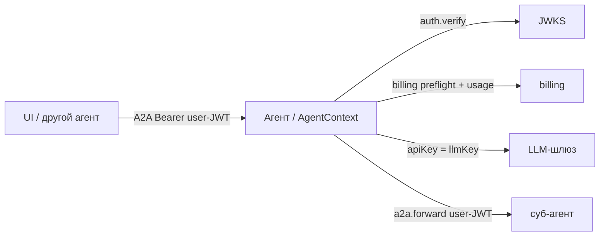
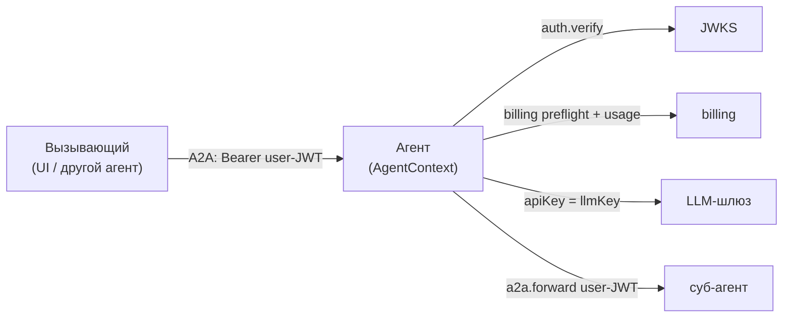

# ai37-agent-sdk

<!-- ai37:card:start (managed by doc-bot — do not edit inside) -->
# ai37-agent-sdk

## Описание
SDK для агентов экосистемы AI37: закрывает сквозные задачи auth (верификация user-JWT по JWKS), billing (runtime state, metered usage, `llmKey`, гейт отказа по `entitlementStatus`, включая `payment_failed`), A2A-forward того же user-JWT и обёртку `AgentContext`. Это монорепо двух реализаций (TypeScript и Python) с общим контрактом, плюс host-слой агентов (`@ai37/agent-host`). SDK не выполняет OIDC-логин — он проверяет и форвардит уже выданный токен.

## Стек
- TypeScript (Node ≥ 22), npm, tsup (пакет `@ai37/agent-sdk`).
- Python (≥ 3.11), poetry, ruff, mypy, pytest (пакет `ai37-agent-sdk`).
- Общий контракт в `contract/` (JSON Schema, `feature-codes.json`, `env.md`), кодоген `make codegen`.
- Host-слой: `packages/ts-host` и `packages/python-host` (A2A, AG-UI, MCP, Redis task store, observability/Langfuse).

## Схема работы
Агент получает A2A-запрос с Bearer user-JWT; `AgentContext` (SDK):
1. `auth.verify` — проверка подписи/iss/aud/exp по JWKS (кэш ключей);
2. billing preflight (`assertExecutionAllowed`) — entitlement (любое значение `!= 'active'` → отказ; `payment_failed` → `PAYMENT_FAILED` проверяется первым, `no_resources` → `NO_TOKENS`), остаток токенов, `llmKey`. Пользовательский текст отказа берётся из единой карты `BILLING_USER_MESSAGES` / `billing_user_message`;
3. LLM-вызов с `apiKey = llmKey`;
4. доменная работа;
5. `reportUsage` после успеха.

При вызове суб-агента модуль `a2a` форвардит тот же user-JWT (`buildA2AAuthHeaders` / `forwardAuthFetch`). Для тестов без сети есть подпакет `testing` (фейки, фикстуры, in-memory billing, тест-токены).


```mermaid
flowchart LR
  C[UI / другой агент] -->|A2A Bearer user-JWT| AG[Агент / AgentContext]
  AG -->|auth.verify| J[JWKS]
  AG -->|billing preflight + usage| B[billing]
  AG -->|apiKey = llmKey| L[LLM-шлюз]
  AG -->|a2a.forward user-JWT| S[суб-агент]
```

## Структура каталогов
- `contract/` — общий контракт SDK: JSON Schema runtime state (включая `entitlementStatus`), коды фич/привилегий, `env.md`.
- `packages/ts/` — TypeScript-реализация SDK (`@ai37/agent-sdk`).
- `packages/python/` — Python-реализация SDK (`ai37-agent-sdk`).
- `packages/ts-host/`, `packages/python-host/` — host-слой агентов (A2A, AG-UI, MCP, task store, observability).

## Публичные интерфейсы
- **SDK (npm/PyPI):** модули `auth`, `billing`, `a2a`, `context` (`AgentContext`), `codes`, `testing`. В `billing` публично экспортируются `BILLING_USER_MESSAGES`, `DEFAULT_BILLING_USER_MESSAGE`, `billingUserMessage`/`billing_user_message`, `friendlyBillingMessage`, `explainDenial`, `BillingDenialReason` (включая `PAYMENT_FAILED`). Python-пакет без CLI (follow-up).
- **CLI (TS):** dev-утилиты (`devJwks`, `devBilling`, `devKey`).
- **Host-слой `@ai37/agent-host`:** A2A, AG-UI, MCP, task-релей, store-backend’ы, observability.

## Зависимости в экосистеме
### Зависит от
- billing-сервиса (`BILLING_BASE_URL`): preflight, runtime state, usage; billing кодирует причину отказа в `entitlementStatus` (`active` / `no_resources` / `payment_failed`).
- JWKS/OIDC issuer (`JWKS_URL`, `ISSUER`, `AUDIENCE`).
- LLM-шлюза (через `llmKey` из runtime state).
- Суб-агентов по A2A (forward user-JWT).
- Redis — только для host-слоя.

### От него зависят
- Агенты AI37, использующие SDK/`AgentContext`.
- Host-пакеты `@ai37/agent-host` (ts-host/python-host) поверх SDK.

## Конфигурация
Ключевые параметры (передаются в настройки SDK; см. `contract/env.md`):
- `ISSUER`, `AUDIENCE`, `JWKS_URL` — auth (JWT-verify).
- `BILLING_BASE_URL` — billing.
- `required` — обязательность проверки auth/billing.
- `llmKey` — из runtime state billing, не из env/JWT; не логировать.

## Данные и хранилища
— У SDK нет собственной БД/миграций. Host-слой использует Redis task store (`packages/*-host/redis_task_store.py`) и store-backend’ы (chat/attachments/file-context).

## Быстрый старт (локально)
— (в предоставленных материалах нет отдельных команд установки/локального запуска; SDK потребляется как зависимость, а разработка/проверка выполняется через корневые Makefile-таргеты — см. ниже).

## Как запускать тесты
```bash
make codegen   # кодоген codes.ts/codes.py из contract/
make ts        # TS: lint + test + build
make py        # Python: ruff + mypy + pytest
make verify    # codegen-парити + оба пакета
```

## Деплой
Библиотека, не сервис: публикация в npm/PyPI через GitHub Actions (`publish-ts.yml`, `publish-python.yml`, `publish-ts-host.yml`, `publish-python-host.yml`). Helm/terraform не используются.

## Связанные документы
- `ecosystem/v2/09-agent-runtime.md` — рантайм агентов.
<!-- ai37:card:end -->

<!-- Ниже — только уникальный человеческий контекст (замысел, инварианты, грабли).
     Не дублируйте сюда «что/как» из карточки выше — её ведёт docs-bot из кода. -->

SDK для **агентов** экосистемы **AI37**. Закрывает четыре сквозные задачи, которые иначе каждый агент
реализует по-своему:

- **auth** — верификация входящего **user-JWT** по JWKS (issuer/audience/exp, кэш ключей);
- **billing** — runtime state + metered usage через billing-сервис (entitlement, остаток токенов,
  ключ LLM-шлюза `llmKey`);
- **a2a** — **forward** того же user-JWT при вызове другого агента по A2A;
- **AgentContext** — sugar над auth+billing (verify → preflight → usage);
- **testing kit** — фейки, фикстуры и тест-токены, чтобы агенты тестировались без внешних сервисов.

Монорепо, две реализации с **общим контрактом** (`contract/`), идентичные по именам и семантике:

| Пакет | Реестр | Путь | Статус |
|---|---|---|---|
| `@ai37/agent-sdk` | npm | `packages/ts` | реализован: auth, billing, a2a, AgentContext, testing, CLI |
| `ai37-agent-sdk` | PyPI | `packages/python` | реализован: auth, billing, a2a, AgentContext, testing (CLI — follow-up) |

> **Это resource-server / agent SDK.** Он *проверяет* и *форвардит* уже выданный токен, но **не
> выполняет OIDC-логин** (Authorization Code + PKCE, обмен code, refresh, сессия) — это сторона
> клиента/UI. Host-слой агента (HTTP + A2A + AG-UI) — отдельный пакет `@ai37/agent-host`.

## Где SDK в работе агента


```mermaid
flowchart LR
  C["Вызывающий<br/>(UI / другой агент)"] -->|"A2A: Bearer user-JWT"| AG["Агент<br/>(AgentContext)"]
  AG -->|"auth.verify"| J["JWKS"]
  AG -->|"billing preflight + usage"| B["billing"]
  AG -->|"apiKey = llmKey"| L["LLM-шлюз"]
  AG -->|"a2a.forward user-JWT"| S["суб-агент"]
```

| Что делает агент | Модуль SDK |
|---|---|
| Проверить входящий JWT + биллинг (preflight/usage) | **`AgentContext`** (auth + billing) |
| Вызвать другого агента по A2A (forward токена) | **`a2a`** (`buildA2AAuthHeaders` / `forwardAuthFetch`) |
| LLM-вызов оплачиваемой моделью | `llmKey` из runtime state → apiKey к LLM-шлюзу |
| Тесты без сети | **`testing`** (фейки/фикстуры/токены) |

## Вне scope

- **OIDC-логин (Relying Party):** Authorization Code + PKCE, обмен code, refresh, сессия — сторона
  клиента/UI. SDK только *проверяет* и *форвардит* уже выданный токен.
- **Token-exchange / делегированные токены** — не реализуем (forward того же user-JWT).
- **Host-слой агента** (HTTP + A2A + AG-UI) — пакет `@ai37/agent-host` поверх этого SDK.

## Безопасность

Никогда не логировать секреты: `Authorization`, `llmKey`, `authToken`. Ключ LLM-шлюза берётся
**только** из runtime state (preflight), не из JWT/тела.

## Контракт и разработка

- **Контракт (источник истины):** [`contract/`](contract/) — claims, runtime state, feature-codes,
  env. Кодоген `codes` в оба пакета: `make codegen`.

```bash
make codegen     # contract/feature-codes.json → codes.ts + codes.py
make ts          # сборка/тесты TS-пакета
make ts-docx     # локальный markdown → DOCX рендерер @ai37/docx
make py          # сборка/тесты Python-пакета (Python 3.11+ / poetry)
make verify      # codegen-парити + TS/Python SDK + @ai37/docx
```

Статус: **0.1.0-alpha**.
