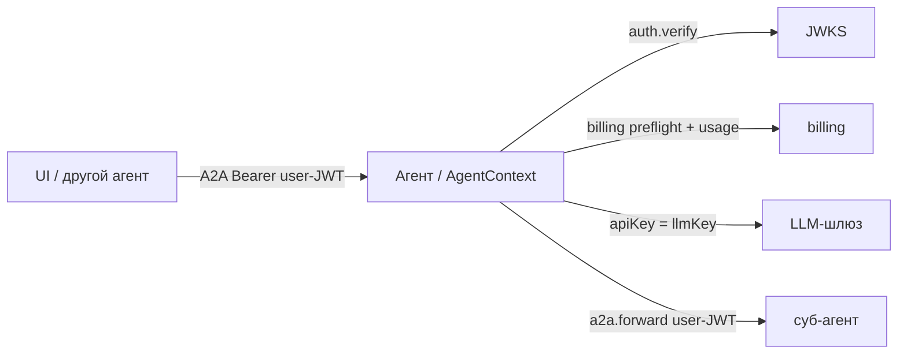
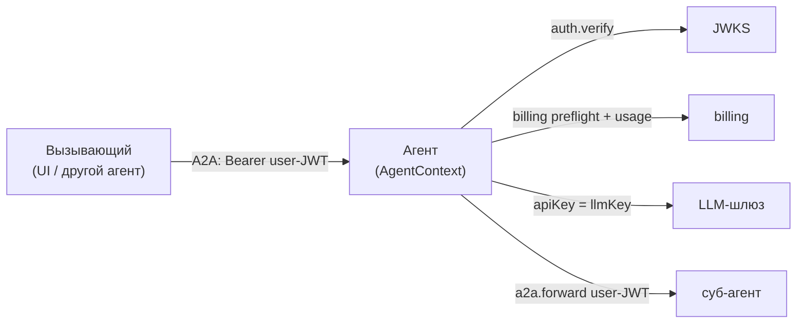

# ai37-agent-sdk

<!-- ai37:card:start (managed by doc-bot — do not edit inside) -->
# ai37-agent-sdk

## Описание
SDK для агентов экосистемы AI37: закрывает сквозные задачи auth (верификация user-JWT по JWKS), billing (runtime state, metered usage, `llmKey`, гейт отказа по `entitlementStatus`, включая `payment_failed`), A2A-forward того же user-JWT и обёртку `AgentContext`. Это монорепо двух реализаций (TypeScript и Python) с общим контрактом, плюс host-слой агентов (`@ai37/agent-host`). Host сам включает Langfuse-трассировку, но по умолчанию содержимое хода в трейс не пишется: только структура, тайминги, идентификаторы и объёмы. SDK не выполняет OIDC-логин — он проверяет и форвардит уже выданный токен.

## Стек
- TypeScript (Node ≥ 22), npm, tsup (пакет `@ai37/agent-sdk`).
- Python (≥ 3.11), poetry, ruff, mypy, pytest (пакет `ai37-agent-sdk`).
- Общий контракт в `contract/` (JSON Schema — runtime state и routing/v1, `feature-codes.json`, `env.md`), кодоген `make codegen`. В `feature-codes.json` — коды фич (`pdai-doc-152fz`, `pdai-doc-187fz`) и привилегий (`pdai-doc-152fz-allowed`, `pdai-doc-187fz-allowed`) для PD-AI документов (152-ФЗ/187-ФЗ).
- Host-слой: `packages/ts-host` (текущая версия `0.1.0-alpha.38`) и `packages/python-host` (A2A, AG-UI, MCP, Redis task store, observability/Langfuse).

## Схема работы
Агент получает A2A-запрос с Bearer user-JWT; `AgentContext` (SDK):
1. `auth.verify` — проверка подписи/iss/aud/exp по JWKS (кэш ключей). Верификатор мемоизируется в `AgentContext.fromRequest`: один живой экземпляр на процесс на каждый уникальный состав auth-настроек (issuer/audience/jwksUrl/leeway/introspection; `required` в ключ не входит), поэтому кэш JWKS-ключей внутри верификатора переживает запросы, и повторный вызов с тем же составом настроек не ходит за ключами. Явный override (`verifier=` / `overrides.verifier`) и несериализуемые конфиги (локальные `jwks`-ключи или `keyResolver`-функция в `issuers[]` у TS) собирают свежий экземпляр в обход кэша.
2. billing preflight (`assertExecutionAllowed`) — entitlement (любое значение `!= 'active'` → отказ; `payment_failed` → `PAYMENT_FAILED` проверяется первым, `no_resources` → `NO_TOKENS`), остаток токенов, `llmKey`. Пользовательский текст отказа берётся из единой карты `BILLING_USER_MESSAGES` / `billing_user_message`;
3. LLM-вызов с `apiKey = llmKey`;
4. доменная работа;
5. `reportUsage` после успеха.

При вызове суб-агента модуль `a2a` форвардит тот же user-JWT (`buildA2AAuthHeaders` / `forwardAuthFetch`). В этом же модуле живёт routing/v1 — компактный семантический профиль (`domains`/`intents`/`excludes`), встраиваемый в `capabilities.extensions` Agent Card для реестра агентов; канонический набор intents включает `document_generation` (генерация документов по исходным данным пользователя). В `contract/feature-codes.json` зарегистрированы коды фич/привилегий PD-AI-документов: `pdai-doc-152fz` / `pdai-doc-187fz` и `pdai-doc-152fz-allowed` / `pdai-doc-187fz-allowed`. Для тестов без сети есть подпакет `testing` (фейки, фикстуры, in-memory billing, тест-токены).

В host-слое `withTurnObservability` открывает turn-спан (Langfuse v5/OTel; env: `LANGFUSE_PUBLIC_KEY`/`LANGFUSE_SECRET_KEY`/`LANGFUSE_BASE_URL`; без ключей — полный no-op). По умолчанию содержимое хода не пишется: вместо `input.text` — `input.textLen`, вместо `output.message` — `status` и `messageLen`, а `payloadMode` помечается как `redacted`. При `LANGFUSE_CAPTURE_CONTENT=true` возвращается прежнее поведение. При выключенном захвате процессору передаётся `mask`, которая закрывает в т.ч. спаны `@langfuse/langchain` (промпты и ответы модели); служебная метаданная `trace.v1` пропускается по маркеру `schemaVersion`.


```mermaid
flowchart LR
  C[UI / другой агент] -->|A2A Bearer user-JWT| AG[Агент / AgentContext]
  AG -->|auth.verify| J[JWKS]
  AG -->|billing preflight + usage| B[billing]
  AG -->|apiKey = llmKey| L[LLM-шлюз]
  AG -->|a2a.forward user-JWT| S[суб-агент]
```

## Структура каталогов
- `contract/` — общий контракт SDK: JSON Schema runtime state (включая `entitlementStatus`), routing/v1 (`a2a-routing-extension.schema.json`, в т.ч. интент `document_generation`), коды фич/привилегий (включая PD-AI: `pdai-doc-152fz`, `pdai-doc-187fz` и соответствующие `-allowed`), `env.md`.
- `packages/ts/` — TypeScript-реализация SDK (`@ai37/agent-sdk`); `src/auth/verifierCache.ts` — мемоизация JWT-верификатора, тесты в `test/verifierCache.test.ts`.
- `packages/python/` — Python-реализация SDK (`ai37-agent-sdk`); мемоизация верификатора в `src/ai37_agent_sdk/context.py` (`_VERIFIER_CACHE`), тесты в `tests/test_verifier_cache.py`.
- `packages/ts-host/`, `packages/python-host/` — host-слой агентов (A2A, AG-UI, MCP, task store, observability/Langfuse; в `packages/ts-host/src/observability/langfuse.ts` — захват/маскирование содержимого, тест `test/langfuse-content.test.ts`).

## Публичные интерфейсы
- **SDK (npm/PyPI):** модули `auth`, `billing`, `a2a`, `context` (`AgentContext`), `codes`, `testing`. В `billing` публично экспортируются `BILLING_USER_MESSAGES`, `DEFAULT_BILLING_USER_MESSAGE`, `billingUserMessage`/`billing_user_message`, `friendlyBillingMessage`, `explainDenial`, `BillingDenialReason` (включая `PAYMENT_FAILED`). В `a2a` — routing/v1: `AI37_ROUTING_EXTENSION_URI`, `AI37_ROUTING_INTENTS`, `buildAgentRoutingExtension`/`build_agent_routing_extension`, `parseAgentRoutingExtension`/`parse_agent_routing_extension`, `normalizeAgentRoutingProfile`/`normalize_agent_routing_profile` (парити TS и Python). В `codes` — `BillingFeatureCode`/`BillingPrivilegeCode` (TS) и одноимённые Enum (Python), пополнены значениями `PdaiDoc152Fz`, `PdaiDoc187Fz`, `PdaiDoc152FzAllowed`, `PdaiDoc187FzAllowed`. Python-пакет без CLI (follow-up).
- **CLI (TS):** dev-утилиты (`devJwks`, `devBilling`, `devKey`).
- **Host-слой `@ai37/agent-host`:** `createAgentHost(...)` собирает Express-приложение; HTTP: `/.well-known/agent-card.json` (Agent Card), `/a2a/v1` (A2A JSON-RPC), `/agui` (AG-UI SSE), `/api/v1/health`, `/api/v1/version`, `/metrics` (Prometheus), `/mcp` (опция `mcp`, StreamableHTTP + OAuth-discovery). Публичные Langfuse-хелперы `isLangfuseContentCaptured`, `langfuseContentMask`, `turnTracePayload`, `turnOutputPayload`; в `TraceMetadataV1` у `payloadMode` добавлено значение `'redacted'` (содержимое хода не пишется при выключенном `LANGFUSE_CAPTURE_CONTENT`). Конверт `metadata.ai37` (`Ai37Metadata`) дополнен опциональным булевым флагом `rerun_last_turn`: клиент перепрогоняет последний ход треда («Заново» под ответом) вместо нового вопроса. Флаг читает оркестратор (откат хвоста последнего хода, чтобы вопрос не задвоился); вниз сабагентам не форвардится; носитель — только AG-UI (`forwardedProps.ai37`, как у `acceptedOutputModes`). Аддитивно — старые клиенты и агенты не затронуты.

## Зависимости в экосистеме
### Зависит от
- billing-сервиса (`BILLING_BASE_URL`): preflight, runtime state, usage; billing кодирует причину отказа в `entitlementStatus` (`active` / `no_resources` / `payment_failed`).
- JWKS/OIDC issuer (`JWKS_URL`, `ISSUER`, `AUDIENCE`).
- LLM-шлюза (через `llmKey` из runtime state).
- Суб-агентов по A2A (forward user-JWT).
- Redis — только для host-слоя.
- Langfuse — опционально, только для host-слоя (env-ключи; без них — no-op).

### От него зависят
- Агенты AI37, использующие SDK/`AgentContext`.
- Host-пакеты `@ai37/agent-host` (ts-host/python-host) поверх SDK.
- Первый потребитель интента `document_generation` — `pdai-doc-gen-agent` (генерация документов 152-ФЗ/187-ФЗ).

## Конфигурация
Ключевые runtime-параметры (передаются в настройки SDK; см. `contract/env.md`):
- `ISSUER`, `AUDIENCE`, `JWKS_URL` — auth (JWT-verify).
- `leeway`, introspection (`url`/`appsToken`/`cacheTtlMs`) — параметры верификации; входят в ключ мемоизации верификатора.
- `BILLING_BASE_URL` — billing.
- `required` — обязательность проверки auth/billing (на ключ мемоизации не влияет).
- `llmKey` — из runtime state billing, не из env/JWT; не логировать.

Трассировка host-слоя (env):
- `LANGFUSE_PUBLIC_KEY`, `LANGFUSE_SECRET_KEY`, `LANGFUSE_BASE_URL` (или `LANGFUSE_HOST`) — включение Langfuse; без ключей — no-op.
- `LANGFUSE_CAPTURE_CONTENT` (default `false`) — `true` вернуть запись содержимого хода (текст пользователя, промпты, результат) в трейс; включать осознанно, где обработка содержимого имеет правовое основание.
- `LANGFUSE_TRACING_ENABLED` (default `true`), `LANGFUSE_TRACING_ENVIRONMENT`, `LANGFUSE_RELEASE` — параметры включения/окружения/релиза трассировки.

CI/публикация (секреты репозитория):
- `AI37_NPM_TOKEN` — base64(`ci-publish:<пароль>`) для `_auth` в корневом `.npmrc` (приватный Verdaccio `npm.app.sp-ai.ru`).
- `AI37_PYPI_TOKEN` — пароль пользователя `ci-publish` (публикация) и `ci-read` (install) приватного PyPI `pypi.app.sp-ai.ru`.
- `POETRY_HTTP_BASIC_AI37_USERNAME` / `POETRY_HTTP_BASIC_AI37_PASSWORD` — HTTP Basic-креды poetry для источника `ai37` (для `python-host` в CI: `ci-read` + токен).
- `TWINE_USERNAME` (`ci-publish`) / `TWINE_PASSWORD` — HTTP Basic-креды для `twine upload`.
- `NPM_CONFIG_USERCONFIG` — в CI указывает на корневой `.npmrc` (`${{ github.workspace }}/.npmrc`), чтобы npm использовал его при работе из подкаталогов `packages/ts` и `packages/ts-host`; требуется в джобе `ts-host` в `ci.yml` (как и в `publish-ts-host.yml`), т.к. `@ai37/a2ui-catalog-schemas` тянется из приватного Verdaccio (`npm.app.sp-ai.ru`) и для `npm ci` нужен `_auth`.

## Данные и хранилища
— У SDK нет собственной БД/миграций. Host-слой использует Redis task store (`packages/*-host/redis_task_store.py`) и store-backend’ы (chat/attachments/file-context).

## Быстрый старт (локально)
— Отдельного сервиса/локального раннапа в репозитории нет: SDK и host — библиотеки. Host ставится из приватного Verdaccio: `npm i @ai37/agent-host @ai37/agent-sdk`; минимальное использование — `createAgentHost({ card, handler, agentContext })` → `app.listen(8080)` (пример в README `packages/ts-host`). У хоста есть health-эндпоинт `/api/v1/health` (и `/api/v1/version`). Параметры окружения описаны в `contract/env.md`; шаблона `.env`/smoke-проверки в материалах нет.

## Как запускать тесты
```bash
make codegen   # кодоген codes.ts/codes.py из contract/
make ts        # TS: lint + test + build
make py        # Python: ruff + mypy + pytest
make verify    # codegen-парити + оба пакета
```
Для `packages/ts-host` дополнительно (package.json): `npm test` (vitest, включая `test/langfuse-content.test.ts`) и `npm run verify` (`lint` + `test` + `build`).

## Деплой
Библиотеки, не сервис: Helm/terraform не используются; публикация — в приватные реестры AI37 через GitHub Actions вручную (`workflow_dispatch`, опция `dry_run` — сборка и проверки без заливки). Текущие версии: `@ai37/agent-sdk` — `0.1.0-alpha.17` (TS), `ai37-agent-sdk` — `0.1.0a9` (Python), `@ai37/agent-host` — `0.1.0-alpha.38` (публикуется независимо от SDK).

- **npm (`@ai37/agent-sdk`, `@ai37/agent-host`)** — приватный Verdaccio `https://npm.app.sp-ai.ru/` (workflows `.github/workflows/publish-ts.yml`, `.github/workflows/publish-ts-host.yml`). Аутентификация — HTTP Basic через закоммиченный корневой `.npmrc` (`@ai37:registry=https://npm.app.sp-ai.ru/`, `//npm.app.sp-ai.ru/:_auth=${AI37_NPM_TOKEN}`, `always-auth=true`); `registry-url` в `setup-node` не задаётся. Чтобы npm читал корневой `.npmrc` при работе из `packages/ts` / `packages/ts-host`, в CI (`publish-ts-host.yml` и джоба `ts-host` в `ci.yml`) задаётся `NPM_CONFIG_USERCONFIG=${{ github.workspace }}/.npmrc`. В `package.json` обоих npm-пакетов `publishConfig`: `registry=https://npm.app.sp-ai.ru/`, `tag=alpha`. Перед publish `prepublishOnly` выполняет `npm run verify` (в т.ч. при `--dry-run`); `@ai37/agent-host` собирается после `@ai37/agent-sdk` (зависимость `file:../ts`).
- **PyPI (`ai37-agent-sdk`, `ai37-agent-host`)** — приватный PyPI `https://pypi.app.sp-ai.ru/` (workflows `.github/workflows/publish-python.yml`, `.github/workflows/publish-python-host.yml`). Сборка: `poetry build --no-interaction`; dry-run: `twine check dist/*`; публикация: `twine upload --repository-url https://pypi.app.sp-ai.ru/ dist/*` с `TWINE_USERNAME=ci-publish` и `TWINE_PASSWORD=${{ secrets.AI37_PYPI_TOKEN }}`. Для `python-host` приватный источник описан в `pyproject.toml` (`[[tool.poetry.source]]` name=`ai37`, `priority=supplemental`); на install используются `POETRY_HTTP_BASIC_AI37_USERNAME=ci-read` / `POETRY_HTTP_BASIC_AI37_PASSWORD`. В `publish-python-host.yml` poetry зафиксирована `==2.3.2` (как генератор `poetry.lock`).
- `@ai37/agent-host` `0.1.0-alpha.38`: зависимость `@ai37/a2ui-catalog-schemas` — `^0.10.0`.

## Связанные документы
- `ecosystem/v2/09-agent-runtime.md` — рантайм агентов.
<!-- ai37:card:end -->

<!-- Ниже — только уникальный человеческий контекст (замысел, инварианты, грабли).
     Не дублируйте сюда «что/как» из карточки выше — её ведёт docs-bot из кода. -->

SDK для **агентов** экосистемы **AI37**. Закрывает четыре сквозные задачи, которые иначе каждый агент
реализует по-своему:

- **auth** — верификация входящего **user-JWT** по JWKS (issuer/audience/exp, кэш ключей);
- **billing** — runtime state + metered usage через billing-сервис (entitlement, остаток токенов,
  ключ LLM-шлюза `llmKey`);
- **a2a** — **forward** того же user-JWT при вызове другого агента по A2A;
- **AgentContext** — sugar над auth+billing (verify → preflight → usage);
- **testing kit** — фейки, фикстуры и тест-токены, чтобы агенты тестировались без внешних сервисов.

Монорепо, две реализации с **общим контрактом** (`contract/`), идентичные по именам и семантике:

| Пакет | Реестр | Путь | Статус |
|---|---|---|---|
| `@ai37/agent-sdk` | npm | `packages/ts` | реализован: auth, billing, a2a, AgentContext, testing, CLI |
| `ai37-agent-sdk` | PyPI | `packages/python` | реализован: auth, billing, a2a, AgentContext, testing (CLI — follow-up) |

> **Это resource-server / agent SDK.** Он *проверяет* и *форвардит* уже выданный токен, но **не
> выполняет OIDC-логин** (Authorization Code + PKCE, обмен code, refresh, сессия) — это сторона
> клиента/UI. Host-слой агента (HTTP + A2A + AG-UI) — отдельный пакет `@ai37/agent-host`.

## Где SDK в работе агента


```mermaid
flowchart LR
  C["Вызывающий<br/>(UI / другой агент)"] -->|"A2A: Bearer user-JWT"| AG["Агент<br/>(AgentContext)"]
  AG -->|"auth.verify"| J["JWKS"]
  AG -->|"billing preflight + usage"| B["billing"]
  AG -->|"apiKey = llmKey"| L["LLM-шлюз"]
  AG -->|"a2a.forward user-JWT"| S["суб-агент"]
```

| Что делает агент | Модуль SDK |
|---|---|
| Проверить входящий JWT + биллинг (preflight/usage) | **`AgentContext`** (auth + billing) |
| Вызвать другого агента по A2A (forward токена) | **`a2a`** (`buildA2AAuthHeaders` / `forwardAuthFetch`) |
| LLM-вызов оплачиваемой моделью | `llmKey` из runtime state → apiKey к LLM-шлюзу |
| Тесты без сети | **`testing`** (фейки/фикстуры/токены) |

## Вне scope

- **OIDC-логин (Relying Party):** Authorization Code + PKCE, обмен code, refresh, сессия — сторона
  клиента/UI. SDK только *проверяет* и *форвардит* уже выданный токен.
- **Token-exchange / делегированные токены** — не реализуем (forward того же user-JWT).
- **Host-слой агента** (HTTP + A2A + AG-UI) — пакет `@ai37/agent-host` поверх этого SDK.

## Безопасность

Никогда не логировать секреты: `Authorization`, `llmKey`, `authToken`. Ключ LLM-шлюза берётся
**только** из runtime state (preflight), не из JWT/тела.

## Контракт и разработка

- **Контракт (источник истины):** [`contract/`](contract/) — claims, runtime state, feature-codes,
  env. Кодоген `codes` в оба пакета: `make codegen`.

```bash
make codegen     # contract/feature-codes.json → codes.ts + codes.py
make ts          # сборка/тесты TS-пакета
make py          # сборка/тесты Python-пакета (Python 3.11+ / poetry)
make verify      # codegen-парити + оба пакета
```

Статус: **0.1.0-alpha**.
