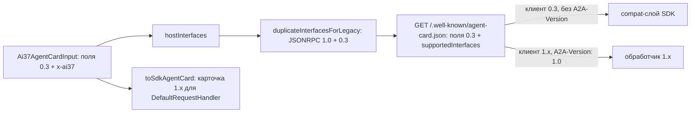
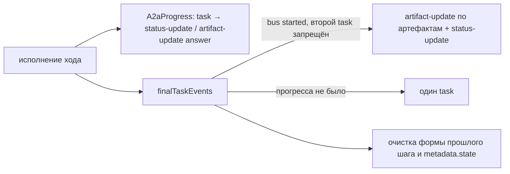
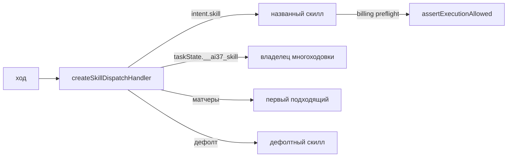
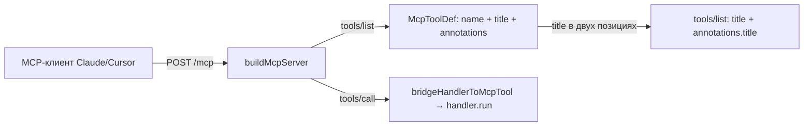
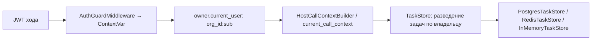
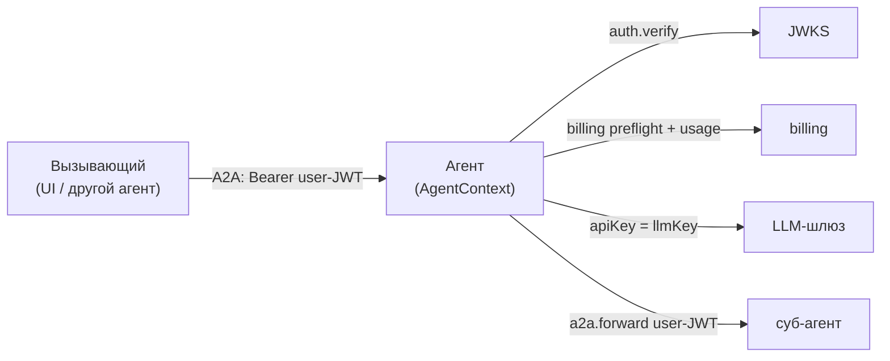

# ai37-agent-sdk

<!-- ai37:card:start (managed by doc-bot — do not edit inside) -->
# ai37-agent-sdk

## Описание

SDK для агентов экосистемы AI37: закрывает сквозные задачи auth (верификация user-JWT по JWKS), billing (runtime state, metered usage, `llmKey`, гейт отказа по `entitlementStatus`, включая `payment_failed`), A2A-forward того же user-JWT и обёртку `AgentContext`. Это монорепо двух реализаций (TypeScript и Python) с общим контрактом плюс host-слой агентов (`@ai37/agent-host`): поверх SDK хост добавляет A2A/AG-UI/MCP-сервер, JWT-guard, генерик-механизм скиллов (subpath `@ai37/agent-host/skills`) и шов durable LangGraph-чекпоинтера. TS-хост версии `0.2.0` стоит на `@a2a-js/sdk` ^1.3.0 и по умолчанию принимает клиентов A2A 0.3 (`legacyCompat`): запрос без заголовка `A2A-Version` или с `0.3` идёт в compat-слой, с `1.0` — в обработчик 1.x, а публичная Agent Card гибридная (поля 0.3 верхнего уровня + `supportedInterfaces`, где JSON-RPC объявлен версиями `1.0` и `0.3`). Форма `input-required` уезжает data-частью `{ a2ui: [...] }` в `status.message`, рядом с текстом паузы (канонное место формы), а `metadata.state` остаётся в `metadata`; копия формы в артефакте `a2ui-<taskId>` кладётся только пока включён `legacyCompat` — её читает relay 0.3. Хост явно очищает то, что прошлый ход оставил, а этот не дал, потому что сервер 1.x мёржит задачу с сохранённой, а не заменяет её. Relay (`@ai37/agent-host/relay`) работает клиентом 1.x с compat 0.3 и фабрикой `createAi37ClientFactory(fetchImpl?)`; `extractA2ui` читает форму в порядке `status.message` → артефакт `a2ui-<taskId>` → `metadata.a2ui`.

Host сам включает Langfuse-трассировку, но по умолчанию содержимое хода в трейс не пишется: только структура, тайминги, идентификаторы и объёмы. Стриминг в A2A-пути нативный: `AgentEvent.text` уезжает `artifact-update`-дельтами одного стабильного артефакта до завершения handler-а, а терминальный Task сохраняет полный канонический ответ. MCP-экспорт агента следует контракту инструмента: у каждого выставленного наружу инструмента обязателен человекочитаемый `title` плюс опциональные хинты поведения (`annotations`). Манифест вложений `ContextFile` (`metadata.ai37.context_files`) несёт опциональные `mime` и `hasRaw` (`mime`/`has_raw` в Python). В модуле `a2a` объявлены два расширения Agent Card: routing/v1 — компактный семантический профиль для реестра, и showcase/v1 — витринные данные агента для каталога продукта. SDK не выполняет OIDC-логин — он проверяет и форвардит уже выданный токен. Плюс общеэкосистемные хелперы: единый разбор политики, объявленной переменной окружения (`policy` / `policy::state`). В python-хосте A2A-задачи можно держать в durable Postgres-сторе — `PostgresTaskStore` (extra `postgres`) поверх upstream `DatabaseTaskStore`, с владельцем задачи из проверенного JWT и ретенцией. Версии пакетов публикуются в приватные npm/PyPI, а dist-tag npm-пакетов выводится из версии: пререлиз (`0.1.0-alpha.N`) → `alpha`, релиз (`0.2.0`) → `latest`.

В монорепо публикуется также доменный пакет `ai37-capture-contract` — контракт захвата карточки товара для рендереров мониторинга цен (browser-worker minstroy и headed-рендерер вне кластера, `AI-37/website-scraper`): модели `POST /capture-batch` и `GET /health` рендерера, коды причин `REASON_*` и сканер цен в DOM `PRICE_HINTS_JS`. Это не слой SDK: на `contract/`, кодоген и публичный API SDK пакет не влияет.

## Стек

- TypeScript (Node ≥ 22), npm, tsup. Пакеты: `@ai37/agent-sdk` (`0.1.0-alpha.30`), `@ai37/agent-host` (`0.2.0`), `@ai37/docx`.
- Python (≥ 3.11), poetry, ruff, mypy, pytest. Пакеты: `ai37-agent-sdk` (`0.1.0a22`), `ai37-agent-host` (`0.1.0a19`), `ai37-capture-contract` (`0.1.0`).
- Общий контракт в `contract/` (JSON Schema — runtime state, routing/v1, showcase/v1 (`a2a-showcase-extension.schema.json`), `feature-codes.json`, `env.md`), кодоген `make codegen`. В `feature-codes.json` — коды фич и привилегий биллинга: `daylight-calc-agent`/`daylight-calc-allowed`, `document-service` с привилегией `document-service-max-uploads`, `elevator-calc-agent`/`elevator-calc-allowed`, `hvac-calc-agent`/`hvac-calc-allowed` (с привилегиями `hvac-air-exchange-allowed` и `hvac-heat-loss-allowed` внутри неё), `minstroy-agent`/`minstroy-check-inn`, `minstroy-price-monitoring`, `thermal-calc-agent`/`thermal-calc-allowed`, `org-limits` с привилегиями `max-users` и `max-api-keys`, а также PD-AI: `pdai-doc-152fz`/`pdai-doc-152fz-allowed`, `pdai-doc-187fz`/`pdai-doc-187fz-allowed`, `pdai-site-check`/`pdai-site-check-allowed`.
- Host-слой: `packages/ts-host` (`@ai37/agent-host`, subpaths `./relay` и `./skills`) и `packages/python-host` (A2A, AG-UI, MCP, Redis/Postgres task store, observability/Langfuse).
- A2A: ts-host на `@a2a-js/sdk` ^1.3.0 (сервер 1.x + compat 0.3 по умолчанию, опция `legacyCompat`; dev-зависимость `a2a-sdk-v03` = `npm:@a2a-js/sdk@0.3.13` для тестов), python-host — `a2a-sdk` >=1.1.0. API-совместимость с 0.3 обеспечивают compat-слои SDK (`@a2a-js/sdk/compat/v0_3`, `duplicateInterfacesForLegacy`, `SecurityScheme.fromJSON`).
- MCP-экспорт host-слоя: `@modelcontextprotocol/sdk` + `zod` (TS, optional-peer, динамический импорт) и официальный python `mcp` SDK (optional-группа `mcp`, soft-import с `MissingMcpDependencyError`).
- LangGraph-checkpointer: `@langchain/langgraph-checkpoint` (>=1.1.2) и `@langchain/langgraph-checkpoint-postgres` (>=1.0.0) — optional peers host-слоя, импортируются лениво (dynamic import) только при использовании `createCheckpointer`/`checkpointer`.
- Метрики host-слоя: `prom-client` (TS, зависимость `@ai37/agent-host`) и `prometheus-client` (Python, зависимость `ai37-agent-host`).
- Durable A2A task store python-хоста: `sqlalchemy[asyncio]` (>=2.0) + `asyncpg` (>=0.29) — optional extra `postgres` python-пакета; в dev-группе дополнительно `aiosqlite`.
- Трассировка host-слоя: `@langfuse/otel`, `@langfuse/tracing`, `@opentelemetry/api`, `@opentelemetry/sdk-node`; `@langfuse/langchain` — optionalDependency.
- `ai37-capture-contract` — Python-пакет из `packages/capture-contract` (версия `0.1.0`, Python ≥ 3.12, единственная runtime-зависимость `pydantic>=2`; dev-группа — `pytest>=8`, `mypy>=1.10`, `ruff>=0.6`; версия рантайма фиксируется файлом `packages/capture-contract/.python-version` = `3.12`), публикуется в приватный PyPI.

## Схема работы

Агент получает A2A-запрос с Bearer user-JWT; `AgentContext` (SDK):
1. `auth.verify` — проверка подписи/iss/aud/exp по JWKS (кэш ключей) и проверка обязательных claim: набор задаётся опцией `requiredClaims` (TS) / `required_claims` (Python), дефолт — `['sub','org_id','billing_org_id']` (`('sub','org_id','billing_org_id')`). Claim обязаны присутствовать непустой строкой, иначе `AuthError` с кодом `missing_claim`. В `MultiIssuerJwtVerifier` то же поле применяется ко всем issuer'ам. Верификатор мемоизируется в `AgentContext.fromRequest`: один живой экземпляр на процесс на каждый уникальный состав auth-настроек; явный override или несериализуемые конфиги собирают свежий экземпляр.
2. billing preflight (`assertExecutionAllowed`) — entitlement (любое значение `!= 'active'` → отказ; `payment_failed` → `PAYMENT_FAILED` проверяется первым, `no_resources` → `NO_TOKENS`), остаток токенов, `llmKey`. Пользовательский текст отказа — из единой карты `BILLING_USER_MESSAGES` / `billing_user_message`.
3. LLM-вызов с `apiKey = llmKey`.
4. доменная работа.
5. `reportUsage` после успеха.

Нормализация входящего A2A-сообщения (`parse.ts` / `parse.py`) читает конверт `metadata.ai37`, включая манифест `context_files`: одна запись `ContextFile` описывается `ref`/`name`/`scope` (+`summary`, `isLarge`) и опциональными `mime` и `hasRaw` (`mime` / `has_raw` в Python-зеркале). В TS-хосте конверт читается из частей сообщения 1.x (`part.content?.$case === 'text' | 'data'`); клиентское сообщение 0.3 compat-слой SDK уже перевёл в эту форму. Отсутствие полей у продюсера постарше даёт `undefined`/`None` — потребитель не падает. На стороне релея (`relay/execute.py`) `_context_file_dict` кладёт `mime` и `hasRaw` в `metadata.ai37.context_files` исходящего сообщения. `mime` — ЗАЯВЛЕНИЕ о файле; `hasRaw` — сохранены ли сырые байты оригинала для детерминированного парсинга агентом.

При вызове суб-агента модуль `a2a` форвардит тот же user-JWT (`buildA2AAuthHeaders` / `forwardAuthFetch`). Форвард готов к A2A 1.x: в TS `forwardAuthFetch` ставит `A2A-Version` только если вызывающий его не задал, а `Authorization` перезаписывает всегда; в Python `build_a2a_auth_headers(..., protocol_version=None)` не добавляет `A2A-Version` вовсе (дефолт — прежний `0.3`). В `contract/feature-codes.json` зарегистрированы коды фич/привилегий биллинга. Сами константы `org-limits`/`max-users`/`max-api-keys` — источник истины для тарифных лимитов; читающего их кода в SDK нет. В этом же модуле `a2a` живёт routing/v1 — компактный семантический профиль (`domains`/`intents`/`excludes`), встраиваемый в `capabilities.extensions` Agent Card для реестра агентов; канонический набор intents включает `document_generation`. Для тестов без сети есть подпакет `testing`.

Второе расширение Agent Card — `showcase/v1` (`AI37_SHOWCASE_EXTENSION_URI`, `https://schemas.ai37.ru/a2a/extensions/showcase/v1`). Профиль: обязательные `title` (≤60) и `summary` (≤160), опциональные `computes` (≤240), `norms` (≤4 записей `{code ≤80, title? ≤200}`), `starter` (≤160), `examples` (≤4 строк ≤160) и `order` (целое). Нормализация обрезает длинный текст до лимита с многоточием (`…`), отбрасывает битые элементы и дубликаты, не выводит пустые опциональные поля; падает только на не-объекте профиля или отсутствии `title`/`summary`. Длина считается в кодовых точках (в TS строка раскладывается в массив `[...text]`), поэтому `len()` в Python и обрезка в TS дают один результат. Парсер fail-open: нет расширения / чужой URI / битый профиль → `undefined`/`None`. Общий санитайзер строк карточки `compactText` / `compact_text` вынесен в `packages/ts/src/a2a/text.ts` / `packages/python/src/ai37_agent_sdk/a2a/text.py` и общий для обоих расширений. Схема контракта — `contract/a2a-showcase-extension.schema.json`.

Отдельный модуль `policy` — общий разбор политики, объявленной переменной окружения: чтение произвольно названной переменной, сведение отсутствия/пустой строки/пробелов/нераспознанного значения к `fallback` вызывающего, точное совпадение с объявленным набором состояний (регистрозависимо, пробелы вокруг годного значения обрезаются). Реализации паритетны: `packages/ts/src/policy/state.ts` и `packages/python/src/ai37_agent_sdk/policy/state.py`.

В host-слое `withTurnObservability` открывает turn-спан (Langfuse v5/OTel; env: `LANGFUSE_PUBLIC_KEY`/`LANGFUSE_SECRET_KEY`/`LANGFUSE_BASE_URL`; без ключей — полный no-op). По умолчанию содержимое хода не пишется: вместо `input.text` — `input.textLen`, вместо `output.message` — `status` и `messageLen`, а `payloadMode` помечается как `redacted`. При `LANGFUSE_CAPTURE_CONTENT=true` возвращается прежнее поведение.

Метрики host-слоя (`GET /metrics`) — низкокардинальные серии `ai37_*`, скрейпится внутрикластерным Alloy'ем. Хост реэкспортирует свой реестр и хелпер лейбла: `hostMetricsRegistry` + `serviceLabel` (TS) и `host_metrics_registry` + `service_label` (Python).

### A2A на SDK 1.x в TS-хосте (0.2.0)

Сервер A2A TS-хоста стоит на `@a2a-js/sdk` 1.x (`DefaultRequestHandler` 1.x, события исполнения через `AgentEvent.task/statusUpdate/artifactUpdate`, части сообщения через `content.$case`, состояния — числовой `TaskState`). Контракт `AgentHandler` (`AgentInput`, `AgentResult.status` строками, `state`) не изменился.

- **Compat 0.3 включён по умолчанию** (`legacyCompat` в `jsonRpcHandler`): запрос без заголовка `A2A-Version` или с `0.3` обрабатывается compat-слоем, с `1.0` — обработчиком 1.x; исполнитель видит только типы 1.x. Выключается опцией `createAgentHost({ legacyCompat: false })`, тогда и карточка не объявляет 0.3. Для `message/stream`/`tasks/resubscribe` клиенту 0.3 ошибка до первого события стрима отдаётся событием SSE (middleware `legacyStreamErrorsAsSse`).
- **Карточка.** Публичная гибридная отдаётся своим роутом (`GET /.well-known/agent-card.json`): поля 0.3 верхнего уровня + `supportedInterfaces`, где JSON-RPC объявлен дважды, версиями `1.0` и `0.3` (`duplicateInterfacesForLegacy`). Клиент 1.x выбирает `1.0`, клиент 0.3 читает `url`. Расширения `x-ai37` копируются как есть. Обработчику SDK хост отдаёт карточку 1.x, собранную из `Ai37AgentCardInput` (`toSdkAgentCard`; схемы безопасности переводятся в protobuf-форму через `SecurityScheme.fromJSON`).
- **Владелец задачи** `<org_id>:<sub>` уходит в стор и через compat-трафик: тот же `hostUserBuilder`; `currentCallContext()` возвращает `new ServerCallContext({ user: currentUser() })`.
- **Форма `input-required` — в `status.message`**, не в `task.metadata.a2ui`: рядом с текстом паузы едет data-часть `{ a2ui: [...] }`. Это канон A2A: на паузе агент в `status.message` объясняет, что ему нужно, и так же кладёт формы расширение A2UI для A2A; артефакт по канону — результат задачи. `metadata.state` остаётся в `metadata`. В стриме 1.x после первого события прогресса второй `task` запрещён, финал хода уходит `artifact-update` + `status-update` (`finalTaskEvents`).
- **Копия формы в артефакте `a2ui-<taskId>` (`name: 'input-required'`) — только пока включён `legacyCompat`.** Relay 0.3 (ts-host до 0.2.0) форму в `status.message` не ищет, а в стриме 1.x финал хода после прогресса приходит `status-update`, из которого старый `drainStream` берёт только статус. Копию он видит в артефактах. `createAgentHost({ legacyCompat: false })` — копии нет; снимок AG-UI (`toAguiSnapshot`) копию не пишет вообще. Хост передаёт свой `legacyCompat` в `HostExecutor` (`legacyFormArtifact`), оттуда — в `toTask(result, taskId, contextId, negotiation, { legacyFormArtifact })`.
- **`extractA2ui` читает форму в порядке** `status.message` → артефакт `a2ui-<taskId>` → `task.metadata.a2ui` и берёт первое найденное место (это копии, они не складываются). Последнее — для агентов на ts-host 0.1.x и python-host. A2UI результата (`completed`) по-прежнему из data-частей остальных артефактов (артефакт формы при этом пропускается).
- **Задача сливается, а не заменяется.** Сервер 1.x мёржит новую задачу с сохранённой (`metadata` по ключам, артефакты по id). Хост явно очищает то, что прошлый ход оставил, а этот не дал: форму прошлого шага (пустой артефакт `a2ui-<taskId>`) и `metadata.state` (`null`, для handler'а это «нет состояния»).
- `configuration.acceptedOutputModes` исполнитель берёт из `rc.request.configuration` (SDK 1.x его отдаёт), чтение тела в `jwtGuard` осталось для ALS и downstream.
- Шина исполнения закрывается сразу после хода, и на `input-required` тоже (`keepBusAliveStates: []`).
- **Relay** (`@ai37/agent-host/relay`) на клиенте 1.x: `SendMessageRequest` 1.x, стрим `StreamResponse` (`payload.$case`), `metadata` из `status-update` сливается в задачу. `RemoteA2aResult.state` по-прежнему строка 0.3, нормализованная из `TaskState`; `RemoteA2aResult.raw` — `Message | Task` в типах 1.x. `isStaleTaskError` узнаёт классы ошибок 1.x (`TaskNotFoundError`, `UnsupportedOperationError` с «terminal» в тексте); код -32001 и текстовые маркеры 0.3 остались.
- Добавлены `createAi37ClientFactory(fetchImpl?)` — `ClientFactory` 1.x с compat 0.3 на резолвере карточки и на транспортах JSON-RPC и HTTP+JSON; `taskStateName(state)` — `TaskState` 1.x → строка 0.3; `isTask(result)` — задача или сообщение.
- `toTask`/`agentMessage`/`toAguiSnapshot` возвращают типы 1.x; `agentMessage(taskId, contextId, text, form?)` кладёт форму второй data-частью (`{ a2ui: form }`) рядом с текстом. Снимок AG-UI без терминального статуса пишется как `TASK_STATE_UNSPECIFIED` (в 0.3 — `unknown`). Сообщения и части собираются хелперами `textPart`/`dataPart` (`packages/ts-host/src/parts.ts`).


```mermaid
flowchart LR
  CARD[Ai37AgentCardInput: поля 0.3 + x-ai37] --> HI[hostInterfaces]
  HI --> DUP[duplicateInterfacesForLegacy: JSONRPC 1.0 + 0.3]
  DUP --> PUB[GET /.well-known/agent-card.json: поля 0.3 + supportedInterfaces]
  CARD --> SDK[toSdkAgentCard: карточка 1.x для DefaultRequestHandler]
  PUB -->|клиент 0.3, без A2A-Version| LEG[compat-слой SDK]
  PUB -->|клиент 1.x, A2A-Version: 1.0| NEW[обработчик 1.x]
```


```mermaid
flowchart LR
  EX[исполнение хода] --> P[A2aProgress: task → status-update / artifact-update answer]
  EX --> F[finalTaskEvents]
  F -->|bus started, второй task запрещён| AU[artifact-update по артефактам + status-update]
  F -->|прогресса не было| T[один task]
  F --> CL[очистка формы прошлого шага и metadata.state]
```

```mermaid
flowchart LR
  R[Task input-required] --> SM[status.message: text + data {a2ui}]
  SM -->|канон, ts-host ≥ 0.2| X1[extractA2ui: место 1]
  R -->|legacyCompat, копия для relay 0.3| AR[артефакт a2ui-taskId]
  AR --> X2[extractA2ui: место 2]
  R -->|ts-host 0.1.x / python-host| MD[task.metadata.a2ui]
  MD --> X3[extractA2ui: место 3]
```

### Хост-слой: скиллы, чекпоинтер, MCP, владелец, Postgres

В host-слое агент строится из скиллов (`@ai37/agent-host/skills`). `SkillProvider` описывает скилл: `id`, `card`, `io`, `routing`, `billing`, `matches`, `handler`. Реестр `createSkillRegistry` / `buildSkillRegistryFromEnv` валидирует и фильтрует включение (fail-closed; дефолтный скилл активен всегда). Корневой handler `createSkillDispatchHandler` выбирает скилл: 1) структурный `metadata.ai37.intent.skill`; 2) владелец многоходовки из `taskState` (ключ `__ai37_skill`); 3) первый матчер; 4) дефолтный скилл. У скилла с `billing` диспетчер до handler-а делает preflight `ctx.assertExecutionAllowed(skill.billing)`. `composeCardWithSkills(base, providers)` собирает Agent Card: записи `skills[]`, вклад скиллов в routing/v1, per-skill биллинг и I/O в блок `x-ai37`. Env-загрузчик `AGENT_SKILL_MODULES` подключает доменные модули инстанса без правки кода агента; ошибки загрузки/валидации роняют старт процесса.

Durable графовое состояние: опциональный `AgentHostOptions.checkpointer` (`BaseCheckpointSaver`) хост кладёт в turn-scope через `jwtGuard`, когниция забирает его через `currentCheckpointer()` и цепляет в граф. Фабрика `createCheckpointer({ databaseUrl })`: `databaseUrl` задан → `PostgresSaver.fromConnString` + идемпотентный `setup()`; пусто/undefined → `MemorySaver`. Пакеты `@langchain/langgraph-checkpoint*` — optional peers, импортируются лениво.

MCP-экспорт host-слоя превращает агента в MCP Resource Server (StreamableHTTP, stateless): опция `mcp: { tools, scopes?, serverName? }` монтирует `/mcp` + OAuth-discovery (`.well-known/oauth-protected-resource`, RFC 9728) за тем же verified auth. Контракт инструмента: `title` (обязателен) и опциональные `annotations` (хинты `readOnlyHint`/`destructiveHint`/`idempotentHint`/`openWorldHint`). Мост `bridgeHandlerToMcpTool` / `bridge_handler_to_mcp_tool` оборачивает когницию A2A-агента в один MCP-tool со схемой `{query}`.


```mermaid
flowchart LR
  R[ход] --> D[createSkillDispatchHandler]
  D -->|intent.skill| S1[названный скилл]
  D -->|taskState.__ai37_skill| S2[владелец многоходовки]
  D -->|матчеры| S3[первый подходящий]
  D -->|дефолт| S4[дефолтный скилл]
  S1 -->|billing preflight| P[assertExecutionAllowed]
```


```mermaid
flowchart LR
  MC[MCP-клиент Claude/Cursor] -->|POST /mcp| H[buildMcpServer]
  H -->|tools/list| T[McpToolDef: name + title + annotations]
  T -->|title в двух позициях| L2[tools/list: title + annotations.title]
  H -->|tools/call| BR[bridgeHandlerToMcpTool → handler.run]
```

Владелец A2A-задачи в python-хосте берётся из проверенного JWT хода и одинаков на A2A- и AG-UI-пути (`owner.py`). Сторы `a2a-sdk` 1.x (`InMemoryTaskStore`, `DatabaseTaskStore`) и `RedisTaskStore` разводят задачи по `owner_resolver(context)`. `HostCallContextBuilder` собирает пользователя из `AgentContext.claims` хода (`JwtUser`, `user_name = <org_id>:<sub>`); `create_agent_host` передаёт его в JSON-RPC- и REST-маршруты, а AG-UI собирает `ServerCallContext` через `current_call_context()`. Без JWT — анонимный пользователь. У `RedisTaskStore` владелец входит в ключ (`{prefix}{owner}:{task_id}`): задачи, поставленные на паузу до обновления, после него не найдутся.


```mermaid
flowchart LR
  JWT[JWT хода] --> AG2[AuthGuardMiddleware → ContextVar]
  AG2 --> OU[owner.current_user: org_id:sub]
  OU --> CB[HostCallContextBuilder / current_call_context]
  CB --> TS2[TaskStore: разведение задач по владельцу]
  TS2 --> PG[PostgresTaskStore / RedisTaskStore / InMemoryTaskStore]
```

Durable A2A task store python-хоста — `PostgresTaskStore` (`ai37_agent_host.postgres_task_store`, extra `postgres`): тонкая обёртка над upstream `a2a.server.tasks.DatabaseTaskStore` (SQLAlchemy async, protobuf-сериализация, owner-scoped `get`/`list`/`delete`). Поверх upstream добавлено: отказ записать/прочитать чужую задачу (`TaskOwnerError` / `None`); неизменяемость завершённой задачи; `assert_ready()`; схема создаётся шагом деплоя (`migrate_postgres_task_store()` / CLI), стор работает с `create_table=False`; ретенция `cleanup(...)` батчами по `last_updated`. Таблица по умолчанию — `a2a_tasks`; `id`/`context_id` расширяются до `varchar(255)`.

Persist-state многоходового A2A-диалога в python-хосте читается из data-part артефактов задачи: `_read_prior_state` перебирает артефакты С КОНЦА и отдаёт ПОСЛЕДНЕЕ записанное состояние, а если артефактов со `state` нет — фолбэк на `task.metadata.state`; `input-required` и `working` публикуются БЕЗ закреплённого `artifact_id`, единственный закреплённый id — `result` у `completed`.

Стриминг прогресса A2A-пути вынесен в модуль `A2aProgress` (`packages/ts-host/src/a2a-progress.ts`, `packages/python-host/src/ai37_agent_host/a2a_progress.py`): `node`/`reasoning` публикуются как `status-update` с `metadata['ai37/node'|'ai37/reasoning']`, `text` — как нативные `artifact-update` append-дельты одного стабильного артефакта (`artifactId = answer-{taskId}`, `name: answer`). Первый `artifact-update` — установочный (`append:false`), далее реальные дельты, `finish()` закрывает артефакт финальным чанком. Терминальный Task сохраняет полный канонический ответ в `status.message`.

### Доменный контракт захвата

`ai37-capture-contract` описывает обмен между агентом мониторинга цен и рендерерами: browser-worker minstroy снимает пачку карточек одного магазина в общей сессии (`CaptureBatchRequest` → `CaptureBatchResponse`) и кладёт снимки в бакет (`storage_key` + `sha256`); рендерер вне кластера отдаёт PNG в теле ответа (`RemoteCaptureBatchResponse`, `png_base64`). Причина отказа едет строкой `reason_code` из стабильного набора `REASON_*`. Порядок ответов — часть контракта: ровно по одному результату на каждый элемент запроса. `GET /health` рендерера читается одним кодом `RendererHealth`. `PRICE_HINTS_JS` — общая строка для `page.evaluate`, возвращающая `{hints, title_bottom}`.

## Структура каталогов

- `contract/` — общий контракт SDK: JSON Schema runtime state, routing/v1 (`a2a-routing-extension.schema.json`), showcase/v1 (`a2a-showcase-extension.schema.json`), коды фич и привилегий, `env.md`.
- `packages/ts/` — TypeScript-реализация SDK (`@ai37/agent-sdk`): `src/auth/verifier.ts` (`JwksJwtVerifier`/`MultiIssuerJwtVerifier`, `DEFAULT_REQUIRED_CLAIMS`), `src/auth/verifierCache.ts`, `src/a2a/forward.ts` (`A2A-Version` не перезаписывается, если задан вызывающим), `src/a2a/routing.ts`, `src/a2a/showcase.ts`, `src/a2a/text.ts`, `src/policy/state.ts`, `src/codes.ts`; тесты `test/a2a.test.ts`, `test/verifierCache.test.ts`, `test/auth.test.ts`, `test/policy.test.ts`, `test/showcase.test.ts`.
- `packages/python/` — Python-реализация SDK (`ai37-agent-sdk`): `src/ai37_agent_sdk/auth/verifier.py`, `src/ai37_agent_sdk/a2a/forward.py` (`build_a2a_auth_headers(..., protocol_version=None)`), `src/ai37_agent_sdk/a2a/showcase.py`, `src/ai37_agent_sdk/a2a/text.py`, `src/ai37_agent_sdk/policy/state.py`, `src/ai37_agent_sdk/codes.py`; тесты `tests/test_a2a.py`, `tests/test_verifier_cache.py`, `tests/test_auth.py`, `tests/test_policy.py`, `tests/test_showcase.py`.
- `packages/ts-host/` — TS host (`@ai37/agent-host`, `0.2.0`): A2A-сервер на `@a2a-js/sdk` 1.x с `legacyCompat`, AG-UI, MCP, task store, observability/Langfuse, скиллы. Ключевые файлы: `src/createAgentHost.ts` (`createAgentHost`, опции `legacyCompat`, `checkpointer`, `mcp`; `legacyCompat` уходит в `HostExecutor`), `src/request-handler.ts` (`HostRequestHandler`), `src/legacy-stream-errors.ts` (`legacyStreamErrorsAsSse`), `src/agent-card.ts` (`Ai37AgentCardInput`, `hostInterfaces`, `toPublicAgentCard`, `toSdkAgentCard`), `src/a2a-executor.ts` (`HostExecutor`, `legacyFormArtifact`), `src/a2a-progress.ts` (`A2aProgress`), `src/build-task.ts` (`toTask` с опцией `{ legacyFormArtifact }`, `agentMessage(taskId, contextId, text, form?)`, `finalTaskEvents`, `toAguiSnapshot`, `formArtifactId`), `src/parts.ts` (`textPart`/`dataPart`), `src/parse.ts` (части 1.x через `content.$case`), `src/owner.ts` (`JwtUser`, `currentUser`, `currentCallContext`, `hostUserBuilder`), `src/als.ts` (turn-scope, `currentCheckpointer`, `currentTurnContext`), `src/relay/` (`execute.ts`, `client-factory.ts` — `createAi37ClientFactory`, `extract.ts` — `extractA2ui`/`formA2ui`), `src/skills/`, `src/mcp/`; тесты `test/agent-card.test.ts`, `test/host.test.ts`, `test/langfuse-content.test.ts`, `test/skills.test.ts`, `test/checkpointer.test.ts`, `test/mcp.test.ts`, `test/metrics-export.test.ts`, `test/a2a-text-stream.test.ts`, `test/final-task-events.test.ts`, `test/relay.test.ts`, `test/compat-mixed-fleet.test.ts`.
- `packages/python-host/` — python host (`ai37-agent-host`): `create_agent_host`, AG-UI, MCP, Redis/Postgres task store, `owner.py`, `a2a_executor.py`, `postgres_task_store.py`, `relay/execute.py`, `metrics.py`, `a2a_progress.py`.
- `packages/ts-docx/` — TS-пакет `@ai37/docx` (детерминированный markdown→DOCX-рендерер; проверяется в CI: lint + test + build).
- `packages/capture-contract/` — доменный Python-пакет `ai37-capture-contract` (`0.1.0`, Python ≥ 3.12, `pydantic>=2`): `models.py`, `remote.py`, `health.py`, `price_hints.py`, `py.typed`, тесты `tests/test_capture_contract.py`.
- Чейнджлоги — по пакетам: `packages/ts/CHANGELOG.md`, `packages/ts-host/CHANGELOG.md`, `packages/python/CHANGELOG.md`, `packages/python-host/CHANGELOG.md`, `packages/capture-contract/CHANGELOG.md`; ссылки собраны в корневом `CHANGELOG.md`.
- `.github/workflows/` — CI (`ci.yml`, джобы `ts-docx`, `ts`, `ts-host`, `python`, `capture-contract`, `python-host`, `codegen-parity` + агрегатный `ci-green`) и публикация (`publish-ts.yml`, `publish-python.yml`, `publish-ts-host.yml`, `publish-python-host.yml`, `publish-ts-docx.yml`, `publish-capture-contract.yml`). Раннер выбирается инпутом `runner` (`auto`/`ubuntu-latest`/`ai37-self-hosted`) и переменными организации `CI_RUNNER`/`CD_RUNNER`. В publish-js дистрибутивный тег (dist-tag) вычисляется из версии пакета.
- `docs/` — внутренние документы репозитория, включая `migrate-to-private-registry-plan.md`.

## Публичные интерфейсы

- **SDK (npm/PyPI):** модули `auth`, `billing`, `a2a`, `context` (`AgentContext`), `codes`, `policy`, `testing`. В `billing` публично экспортируются `BILLING_USER_MESSAGES`, `DEFAULT_BILLING_USER_MESSAGE`, `billingUserMessage`/`billing_user_message`, `friendlyBillingMessage`, `explainDenial`, `BillingDenialReason` (включая `PAYMENT_FAILED`). В `a2a` — routing/v1 (`AI37_ROUTING_EXTENSION_URI`, `AI37_ROUTING_INTENTS`, `buildAgentRoutingExtension`, `parseAgentRoutingExtension`, `normalizeAgentRoutingProfile` и snake_case-зеркала) и showcase/v1 (`AI37_SHOWCASE_EXTENSION_URI`, `buildAgentShowcaseExtension`, `normalizeAgentShowcaseProfile`, `parseAgentShowcaseExtension`; Python-зеркала). В `auth` — `JwtVerifierOptions.requiredClaims` / `required_claims` (дефолт `['sub','org_id','billing_org_id']`, нарушение → `AuthError` `missing_claim`). В `a2a.forward` — `forwardAuthFetch` не перезаписывает заданный клиентом `A2A-Version`; Python `build_a2a_auth_headers(..., protocol_version=None)`. В `policy` — `parsePolicyState`/`readPolicyState`/`PolicyStateOptions` (TS) и `parse_policy_state`/`read_policy_state`/`PolicyStateOptions` (Python). В `codes` — `BillingFeatureCode`/`BillingPrivilegeCode` и одноимённые Enum.
- **CLI (TS):** dev-утилиты (`devJwks`, `devBilling`, `devKey`). Python-пакет без CLI.
- **Host-слой `@ai37/agent-host` (TS, `0.2.0`):** `createAgentHost(opts)` собирает Express-приложение. HTTP: `/.well-known/agent-card.json` (гибридная карточка своим роутом), `/a2a/v1` (A2A JSON-RPC 1.0 и 0.3 через `legacyCompat`), `/agui` (AG-UI SSE), `/api/v1/health`, `/api/v1/version`, `/metrics` (Prometheus), `/mcp` (опция `mcp`). Опции: `card: Ai37AgentCardInput`, `handler`, `agentContext`, `catalogId`, `taskStore`, `checkpointer`, `legacyCompat` (default `true`), `mcp`. Экспортируются `Ai37AgentCardInput` и типы её частей, `Ai37AgentCardInterface`, `hostInterfaces(card, legacyCompat?)`, `toPublicAgentCard(card, opts?)`, `toSdkAgentCard(card, opts?)`, `AgentInterface`, `PublicAgentCard`, `JwtUser`, `currentUser`, `currentCallContext`, `hostUserBuilder`, `currentCheckpointer`, `createCheckpointer`, `currentTurnContext`, `loadTaskState`/`saveTaskState`, `hostMetricsRegistry`, `serviceLabel`, `TaskStore`, `InMemoryTaskStore`, `ServerCallContext`, `publishArtifact`, `ArtifactsStoreBackend`, `ContextFile`. В `./relay`: `executeRemoteA2a`, `executeRemoteA2aStreaming`, `createAi37ClientFactory(fetchImpl?)`, `isStaleTaskError`, `taskStateName(state)`, `isTask(result)`, `extractText`, `extractA2ui`, типы `Client`, `ClientFactory`. Subpath `./skills`: `createSkillRegistry`, `createSkillDispatchHandler`, `SKILL_STATE_KEY`, `composeCardWithSkills`, `buildSkillRegistryFromEnv`, `loadSkillProvidersFromEnv`, `SkillProvider` и др.
- **BREAKING (`@ai37/agent-host` `0.2.0`, план `plans/ts-a2a-sdk-1x-database-task-store.md`):** сервер на `@a2a-js/sdk` 1.x; карточка — гибридная (`Ai37AgentCardInput`, `supportedInterfaces` со JSON-RPC `1.0` и `0.3`); форма `input-required` — data-частью `{ a2ui: [...] }` в `status.message` (копия в артефакте `a2ui-<taskId>` есть только при `legacyCompat`); `RemoteA2aResult.raw` — `Message | Task` в типах 1.x; `toTask`/`agentMessage`/`toAguiSnapshot` возвращают типы 1.x. Миграция: бамп до `^0.2.0`; `@a2a-js/sdk` из прямых зависимостей убрать (если импорт остался — `^1.3.0`); `TaskStore` — из `@ai37/agent-host`; свой A2A-клиент — через `createAi37ClientFactory(fetchImpl)`; код, читавший `raw.kind`/`part.kind === 'data'`/`status.state === 'input-required'`, переводится на `isTask`, `part.content?.$case`, `taskStateName`, а форма паузы берётся через `extractA2ui` (она теперь в `status.message`, копия в артефакте — пока у агента `legacyCompat`).
- **MCP-контракт инструмента (TS `packages/ts-host/src/mcp/types.ts`, Python `ai37_agent_host/mcp/types.py`):** `McpToolDef` — `name`, **обязательный `title`**, `description`, опциональные `annotations?: McpToolAnnotations`, `inputSchema`, `handler`; `McpToolAnnotations` — хинты поведения без `title`. `buildMcpServer` (TS) / `_tool_annotations` + `_list_tools` (Python) кладут `title` и верхним полем `Tool`, и в `ToolAnnotations.title`. `BridgeToolOptions` (`bridgeHandlerToMcpTool` / `bridge_handler_to_mcp_tool`) — `name`, **обязательный `title`**, `description`, опциональные `annotations`, `inputSchema`/`input_schema`, `textModes`/`text_modes`, `renderResult`/`render_result`. **BREAKING** в CHANGELOG `@ai37/agent-host` `0.1.0-alpha.42`.
- **Python host (`ai37-agent-host`):** `create_agent_host(..., task_store=..., checkpointer=...)`, `current_checkpointer()`, `host_metrics_registry`, `service_label`, `owner.py` (`JwtUser`, `current_user`, `current_call_context`, `HostCallContextBuilder`), `PostgresTaskStore`, `create_engine`, `to_async_url`, `migrate_postgres_task_store`, CLI `python -m ai37_agent_host.postgres_task_store migrate|cleanup`. Внутренний `_read_prior_state` — не часть публичного API.
- **PyPI-пакет `ai37-capture-contract` (`0.1.0`):** доменный контракт, HTTP-эндпоинтов сам не поднимает. Модуль `models`: `CaptureBatchRequest`/`CaptureBatchResponse`, `CaptureRequest`, `CaptureBatchItem`, `CaptureResponse`, `CaptureStatus`, `Screenshot`, `ScreenshotRole`, `CaptureEnvironment`, `ActionRecord`, `PriceHint`, `Clip`; константы `REASON_*`. Модуль `remote`: `RemoteScreenshot`, `RemoteCaptureResponse`, `RemoteCaptureBatchResponse`. Модуль `health`: `RendererHealth`, `RendererKind`, `RendererState`, `RendererCapacity`, `ExitHealth`. Модуль `price_hints`: `PRICE_HINTS_JS`.

## Зависимости в экосистеме

### Зависит от

- SDK `@ai37/agent-sdk` (peer-зависимость host-слоя, `>=0.1.0-alpha.11`).
- `@a2a-js/sdk` `^1.3.0` — ts-host (сервер и клиент 1.x); compat 0.3 встроен в SDK (`legacyCompat`), в dev-зависимостях `a2a-sdk-v03` (`npm:@a2a-js/sdk@0.3.13`) для тестов смешанного парка. python-host — `a2a-sdk >=1.1.0`.
- billing-сервиса (`BILLING_BASE_URL`): preflight, runtime state, usage; billing кодирует причину отказа в `entitlementStatus`.
- JWKS/OIDC issuer (`JWKS_URL`, `ISSUER`, `AUDIENCE`).
- LLM-шлюза (через `llmKey` из runtime state).
- Суб-агентов по A2A (forward user-JWT и манифеста `context_files` c `mime`/`hasRaw`).
- Redis — только для host-слоя (опциональный extra `redis`).
- Postgres — для durable-режима: LangGraph-чекпоинтер (`createCheckpointer({ databaseUrl })`) и durable A2A task store python-хоста (`PostgresTaskStore`, extra `postgres`).
- Langfuse — опционально, только для host-слоя.
- `prom-client` (TS) и `prometheus-client` (Python) — для `GET /metrics` и реэкспорта реестра.
- `@langchain/langgraph-checkpoint` / `...-postgres` — optional peers host-слоя.
- `sqlalchemy[asyncio]` + `asyncpg` — optional extra `postgres` python-хоста; `aiosqlite` — dev-зависимость.
- `@modelcontextprotocol/sdk` + `zod` (TS) и python `mcp` — только при использовании MCP-экспорта; грузятся динамически/soft-import. Отсутствие `mcp` → `MissingMcpDependencyError`.
- `pydantic>=2` — единственная runtime-зависимость `ai37-capture-contract`; экосистемных сервисов он не вызывает.
- Внешние зависимости ядра SDK: `jose` + `lru-cache` (TS), `pyjwt[crypto]` + `httpx` (Python).
- `@ai37/a2ui-catalog-schemas` `^0.10.0` — из приватного Verdaccio, нужен `NPM_CONFIG_USERCONFIG` в CI/публикации ts-host.
- `@langfuse/otel`, `@langfuse/tracing`, `@opentelemetry/api`, `@opentelemetry/sdk-node` — трассировка host-слоя.

### От него зависят

- Агенты AI37, использующие SDK/`AgentContext`.
- Host-пакеты `@ai37/agent-host` и `ai37-agent-host` поверх SDK.
- Клиенты Agent Card: гибридная карточка TS-хоста (поля 0.3 + `supportedInterfaces` с JSON-RPC `1.0` и `0.3`) читается клиентами 0.3 (лишнее поле игнорируется) и клиентами 1.x (выбирает `1.0`-интерфейс); расширения `x-ai37` сохраняются для оркестратора.
- Потребители relay: новые фабрики `createAi37ClientFactory(fetchImpl)` и normalized `RemoteA2aResult.state` (строки 0.3) для совместимости со смешанным парком клиентов 0.3/1.x.
- Потребители `extractA2ui` (relay/оркестратор): форма паузы берётся из первого места порядка `status.message` → артефакт `a2ui-<taskId>` → `metadata.a2ui`; места — копии, они не складываются, пустая форма в `status.message` означает «формы нет».
- Клиенты 0.3, читающие копию формы в артефакте `a2ui-<taskId>`: копия живёт только пока у агента включён `legacyCompat`.
- Потребители форварда A2A-заголовков: клиенты 1.x не уводятся в legacy-обработчик сервера 1.x, клиенты 0.3 поведение не меняют.
- Сервис `document-service` — потребитель кодов `document-service` и `document-service-max-uploads`.
- Агенты, публикующие витринные данные для каталога продукта (showcase/v1).
- Сервисы на этом хосте, регистрирующие свою серию метрик через `hostMetricsRegistry`/`host_metrics_registry`.
- Агенты, экспортирующие себя как MCP Resource Server: их `McpToolDef` теперь обязаны нести `title`.
- Потребители стрима A2A: relay-extraction поднимает `artifact-update` append-дельты как `text`-события; терминальный текст берётся из `status.message`.
- Суб-агенты, получающие от релея манифест `context_files` (довозятся `mime` и `hasRaw`).
- Агенты на python-хосте с многоходовым A2A-диалогом: per-turn persist-state читается из последнего артефакта задачи.
- Потребители durable A2A task store python-хоста: `PostgresTaskStore`, `assert_ready()` на старте, миграция Job'ом, ретенция CronJob'ом.
- Потребители владельца задачи из JWT: все сторы python-хоста разводят задачи по `<org_id>:<sub>`.
- Потребители пакета `ai37-capture-contract`: browser-worker minstroy и рендереры вне кластера (`AI-37/website-scraper`).
- Первый потребитель интента `document_generation` — `pdai-doc-gen-agent`.
- Первый потребитель генерик-механизма скиллов — `document-service`.
- Потребители кодов биллинга `daylight-calc-agent`, `hvac-calc-agent` и т.д.
- Потребители auth-верификатора с платформенным субъектом без организации.
- Вызывающие гейты, объявленные переменной окружения (модуль `policy`).

## Конфигурация

Ключевые runtime-параметры SDK (см. `contract/env.md`):
- `ISSUER`, `AUDIENCE`, `JWKS_URL` — auth (JWT-verify).
- `leeway`, introspection (`url`/`appsToken`/`cacheTtlMs`) — параметры верификации; входят в ключ мемоизации верификатора.
- `requiredClaims` (TS) / `required_claims` (Python) — набор claim, обязательных непустой строкой; дефолт `['sub','org_id','billing_org_id']`. Не-env: передаётся в опциях верификатора.
- `BILLING_BASE_URL` — billing.
- `llmKey` — из runtime state billing, не из env/JWT; не логировать.
- Подпакет `policy` собственных env-переменных не вводит.

Трассировка host-слоя (env):
- `LANGFUSE_PUBLIC_KEY`, `LANGFUSE_SECRET_KEY`, `LANGFUSE_BASE_URL` (или `LANGFUSE_HOST`).
- `LANGFUSE_CAPTURE_CONTENT` (default `false`).
- `LANGFUSE_TRACING_ENABLED` (default `true`), `LANGFUSE_TRACING_ENVIRONMENT`, `LANGFUSE_RELEASE`.

Host-слой TS:
- `legacyCompat` — опция `createAgentHost` (default `true`): принимать ли клиентов A2A 0.3; вместе с compat включается и копия формы `input-required` в артефакте `a2ui-<taskId>` (её читает только relay 0.3), а при `false` копии нет и 0.3-интерфейса в карточке нет.
- `AgentHostOptions.checkpointer` — Postgres-URL для durable графового состояния (собирается `createCheckpointer({ databaseUrl })`).
- `AGENT_SKILL_MODULES` — список модулей скиллов через запятую.
- `AGENT_ENABLED_SKILLS` — id включаемых скиллов через запятую (fail-closed).

Durable A2A task store python-хоста (env):
- `DATABASE_URL` — для CLI `python -m ai37_agent_host.postgres_task_store migrate|cleanup`.
- `TEST_DATABASE_URL` — только тесты/CI.
- `AI37_AUTH_REQUIRED=false` — владелец задачи анонимный.

CI/публикация:
- `AI37_NPM_TOKEN`, `AI37_PYPI_TOKEN`, `POETRY_HTTP_BASIC_AI37_USERNAME`/`PASSWORD`, `TWINE_USERNAME`/`TWINE_PASSWORD`, `NPM_CONFIG_USERCONFIG`.
- `CI_RUNNER` / `CD_RUNNER` — переменные организации (JSON-массив меток раннера), переопределяются инпутом `runner` (`auto`/`ubuntu-latest`/`ai37-self-hosted`).

## Данные и хранилища

— У SDK нет собственной БД/миграций. `policy` состояния не хранит. `showcase/v1` — витринные данные самой Agent Card, не хранилище. Гибридная карточка (`toPublicAgentCard`) ничего не хранит: `supportedInterfaces` вычисляется при отдаче. Host-слой использует Redis task store и store-backend'ы. Манифест `metadata.ai37.context_files` несёт хинт-описание файла; тело тянется отдельно через store по `ref`. Задачи A2A во всех сторах разведены по владельцу (`ServerCallContext.user.userName` = `<org_id>:<sub>`; без JWT — пустой владелец); у `RedisTaskStore` владелец входит в ключ. Python-хост умеет держать задачи в durable Postgres — `PostgresTaskStore` (таблица по умолчанию `a2a_tasks`, `id`/`context_id` — `varchar(255)`, схему создаёт шаг деплоя, стор работает с `create_table=False` и проверяет таблицу в `assert_ready()`). Персистентное состояние хода A2A-задачи python-хост держит в data-part артефактов задачи (читается ПОСЛЕДНИЙ артефакт со `state`; `input-required`/`working` без закреплённого `artifact_id`, `completed` — с `artifact_id = result`). В TS-хосте форма `input-required` едет data-частью `{ a2ui: [...] }` в `status.message` рядом с текстом паузы (канонное место формы), `metadata.state` — в `metadata`, а копия формы — в артефакте `a2ui-<taskId>` (`name: 'input-required'`) и только при `legacyCompat`; сервер 1.x мёржит задачу с сохранённой, поэтому хост явно чистит форму прошлого шага и `metadata.state` (`null`). Стриминговые text-дельты артефакта `answer` — живая проекция ответа; авторитетный текст — `status.message` терминального Task. Опциональный durable LangGraph-чекпоинтер пишет графовое состояние в Postgres (`checkpoints`/`checkpoint_blobs`/`checkpoint_writes`/`checkpoint_migrations`); ретенция старых тредов — вне пакета. MCP-экспорт собственного хранилища не заводит. Метрики ведутся в in-process реестре prometheus и никуда не персистятся. `ai37-capture-contract` собственного хранилища не заводит: снимки browser-worker едут в бакет, PNG рендерера — в теле ответа.

## Быстрый старт (локально)

— Отдельного сервиса/локального раннапа в репозитории нет: SDK и host — библиотеки. Host ставится из приватного Verdaccio: `npm i @ai37/agent-host @ai37/agent-sdk`; минимальное использование — `createAgentHost({ card, handler, agentContext })` → `app.listen(8080)` (пример в README `packages/ts-host`). Скиллы подключаются через subpath `@ai37/agent-host/skills`:

```ts
const registry = await buildSkillRegistryFromEnv({ builtin: createSearchDocsSkill() })
createAgentHost({
  card: composeCardWithSkills(buildAgentCard(baseUrl), registry.all()),
  handler: createSkillDispatchHandler(registry),
  // ...
})
```

Agent Card хост отдаёт сам, в гибридной форме (`GET /.well-known/agent-card.json` → `toPublicAgentCard(card)`), поэтому отдельный роут агента для карточки не нужен. Клиенты A2A 0.3 принимаются по умолчанию (`legacyCompat: true`); выключить — `createAgentHost({ legacyCompat: false })`, вместе с 0.3-интерфейсом карточки выключается и копия формы `input-required` в артефакте `a2ui-<taskId>` (сама форма остаётся в `status.message`).

Звать другого агента — через relay и готовую фабрику клиентов (compat 0.3 на клиенте включён всегда):

```ts
import { createAi37ClientFactory, executeRemoteA2a } from '@ai37/agent-host/relay'

const client = await createAi37ClientFactory(fetchWithAuth).createFromUrl(agentBaseUrl)
const res = await executeRemoteA2a(client, { query, contextId, resumeTaskId })
// res.state: 'completed' | 'input-required' | 'failed' | 'message' (строки 0.3)
// res.a2ui: форма паузы — из status.message, затем из артефакта a2ui-<taskId>, затем из metadata.a2ui
```

Для durable графового состояния в `createAgentHost` передаётся `checkpointer`, собранный фабрикой `createCheckpointer({ databaseUrl })`. Свою серию метрик сервис регистрирует в реестре хоста:

```ts
import { Gauge } from 'prom-client'
import { hostMetricsRegistry, serviceLabel } from '@ai37/agent-host'

new Gauge({
  name: 'my_service_queue_depth',
  help: 'Глубина очереди сервиса',
  registers: [hostMetricsRegistry],
})
```

```python
from prometheus_client import Gauge
from ai37_agent_host import host_metrics_registry, service_label

Gauge('my_service_queue_depth', 'Глубина очереди сервиса', registry=host_metrics_registry)
```

MCP-экспорт включается опцией `mcp` у `createAgentHost` — каждому инструменту обязателен `title`:

```ts
createAgentHost({
  card,
  handler,
  mcp: {
    tools: [
      {
        name: 'calc_lifts',
        title: 'Расчёт лифтов по ГОСТ',
        description: 'Расчёт лифтов',
        annotations: { readOnlyHint: true, idempotentHint: true },
        handler: (args) => ({ content: [{ type: 'text', text: String(args.query) }] }),
      },
    ],
    scopes: ['mcp'],
  },
})
```

Durable A2A task store в python-хосте (extra `postgres`):

```bash
pip install 'ai37-agent-host[postgres]'
```

```python
from ai37_agent_host import create_agent_host
from ai37_agent_host.postgres_task_store import PostgresTaskStore, create_engine

store = PostgresTaskStore(create_engine(os.environ['DATABASE_URL']))
await store.assert_ready()
app = create_agent_host(card=..., handler=..., agent_context=..., task_store=store)
```

CLI для Helm-хука и CronJob:

```bash
DATABASE_URL=postgres://... python -m ai37_agent_host.postgres_task_store migrate
DATABASE_URL=postgres://... python -m ai37_agent_host.postgres_task_store cleanup --terminal-days 7 --stale-days 30
```

Верификатор с сокращённым набором обязательных claim и разбор env-политики:

```ts
createJwtVerifier({ issuer, audience, jwksUrl, requiredClaims: ['sub'] })
const ADMIN = { states: ['relaxed', 'attributed', 'closed'] as const, fallback: 'closed' as const }
const mode = readPolicyState('ADMIN_CONTENT_READ', ADMIN)
```

```python
JwksJwtVerifier(issuer=..., audience=..., jwks_url=..., required_claims=['sub'])
ADMIN = PolicyStateOptions(states=('relaxed', 'attributed', 'closed'), fallback='closed')
mode = read_policy_state('ADMIN_CONTENT_READ', ADMIN)
```

Витринное расширение карточки `showcase/v1`:

```ts
const showcase = buildAgentShowcaseExtension({
  title: 'Расчёт лифтов',
  summary: 'Подбор числа и параметров лифтов по этажности и заселённости',
  computes: 'Число лифтов, интервал движения, провозная способность группы',
  norms: [{ code: 'ГОСТ 34758-2021', title: 'Лифты. Определение числа, параметров и размеров лифтов' }],
  starter: 'Запусти расчёт лифтов',
  examples: ['Подбери лифты для жилого дома 17 этажей'],
  order: 3,
})
```

Манифест вложения с `mime`/`hasRaw`:

```json
{
  'ref': 'chat-attachment:1',
  'name': 'list.xlsx',
  'scope': 'chat',
  'isLarge': true,
  'mime': 'application/vnd.openxmlformats-officedocument.spreadsheetml.sheet',
  'hasRaw': true
}
```

Доменный пакет `ai37-capture-contract` поднимается локально как обычный poetry-проект:

```sh
cd packages/capture-contract
poetry install
poetry run pytest && poetry run mypy src && poetry run ruff check .
```

У хоста есть health-эндпоинт `/api/v1/health` (и `/api/v1/version`) — реальная smoke-проверка поднятого хоста; `GET /metrics` отдаёт серии метрик; `GET /.well-known/agent-card.json` отдаёт гибридную карточку. Параметры окружения описаны в `contract/env.md`; отдельного шаблона `.env` в материалах нет.

## Как запускать тесты

```bash
make codegen   # кодоген codes.ts/codes.py из contract/feature-codes.json
make ts        # TS: lint + test + build
make ts-docx   # TS: @ai37/docx (lint + test + build)
make py        # Python: ruff + mypy + pytest
make capture-contract  # ai37-capture-contract: ruff + ruff format --check + mypy + pytest
make verify    # codegen-парити + все перечисленные пакеты
```

Для `packages/ts` (package.json): `npm test` (vitest run) — включая `test/a2a.test.ts` (forward-заголовки), `test/auth.test.ts` (`requiredClaims`), `test/policy.test.ts`, `test/showcase.test.ts` (обрезка по кодовым точкам); `npm run verify` (`lint` + `test` + `build`).

Для `packages/ts-host` дополнительно: `npm test` (vitest) — `test/agent-card.test.ts` (гибридная карточка: поля 0.3 + `supportedInterfaces` с JSON-RPC `1.0` и `0.3`; сохранение `x-ai37`), `test/host.test.ts` (поведение сервера A2A 1.x при `legacyCompat`; форма паузы в `status.message` и её копия в артефакте), `test/final-task-events.test.ts` (форма `input-required` в `status.message`, копия при `legacyCompat` и её отсутствие при `legacyFormArtifact: false`, очистка хвостов прошлого хода), `test/relay.test.ts` (порядок мест формы в `extractA2ui`: `status.message` → артефакт → `metadata.a2ui`; копии не задваиваются), `test/compat-mixed-fleet.test.ts` (смешанный парк 0.3/1.x на живых HTTP-серверах), `test/langfuse-content.test.ts`, `test/skills.test.ts`, `test/checkpointer.test.ts`, `test/mcp.test.ts` (обязательный `title` в `tools/list` и через мост), `test/metrics-export.test.ts`, `test/a2a-text-stream.test.ts` (нативный A2A-стрим `text` дельтами) и `npm run verify`.

Для `packages/python` — pytest (testpaths в `pyproject.toml`: `tests`): `tests/test_a2a.py`, `tests/test_auth.py`, `tests/test_policy.py`, `tests/test_showcase.py`.

Для `packages/capture-contract` (poetry, testpaths `tests`): `make capture-contract` или вручную из каталога пакета:

```sh
cd packages/capture-contract
poetry install --with dev
poetry run ruff check . && poetry run ruff format --check . && poetry run mypy src && poetry run pytest
```

Для `packages/python-host` — pytest: `tests/test_metrics_export.py`, `tests/test_checkpointer.py`, `tests/test_executor_streaming.py`, `tests/test_executor_text_stream.py`, `tests/test_prior_state.py`, `tests/test_mcp_server.py`, `tests/test_mcp_bridge.py`, `tests/test_parse.py`, `tests/test_relay_execute.py`, `tests/test_owner.py`, `tests/test_postgres_task_store.py` (SQLite всегда, живой Postgres при `TEST_DATABASE_URL`). Раннер джоб выбирается инпутом `runner` (`auto`/`ubuntu-latest`/`ai37-self-hosted`) → переменная организации `CI_RUNNER` → `ubuntu-latest`.

## Деплой

Библиотеки, не сервис: Helm/terraform не используются; публикация — в приватные реестры AI37 через GitHub Actions вручную (`workflow_dispatch`, опция `dry_run`). Workflow публикации: `publish-ts.yml`, `publish-python.yml`, `publish-ts-host.yml`, `publish-python-host.yml`, `publish-ts-docx.yml`, `publish-capture-contract.yml`. Текущие версии: `@ai37/agent-sdk` — `0.1.0-alpha.30`, `ai37-agent-sdk` — `0.1.0a22`, `@ai37/agent-host` — `0.2.0` (публикуется независимо от SDK; subpaths `./relay` и `./skills`), `ai37-agent-host` — `0.1.0a19`, `ai37-capture-contract` — `0.1.0`, `@ai37/docx` — `0.1.0-alpha.1`.

**dist-tag по версии (все npm-publish workflow).** Дистрибутивный тег вычисляется из `package.json`: версия с пререлизным суффиксом (`0.1.0-alpha.N`) → `alpha`, релизная (`0.2.0`) → `latest`; шаг `dist-tag` пишет `tag` в `$GITHUB_OUTPUT`, а `npm publish --tag ${{ steps.disttag.outputs.tag }}` используется и при публикации, и при `--dry-run`. Раньше `--tag alpha` был захардкожен (для `publish-ts.yml` — `prepublishOnly` и знание дистрибутивного тега остаются), поэтому релиз не становился `latest`. Из `publishConfig` пакетов `@ai37/agent-host` и `@ai37/docx` поле `tag: alpha` убрано — тег теперь задаёт CI из версии. Выбор раннера — канон AI-37: инпут `runner` (`auto` (дефолт) / `ubuntu-latest` / `ai37-self-hosted`) важнее переменной организации (`vars.CI_RUNNER` в `ci.yml`, `vars.CD_RUNNER` в `publish-*.yml`); иначе `ubuntu-latest`.

- **npm (`@ai37/agent-sdk`, `@ai37/agent-host`, `@ai37/docx`)** — приватный Verdaccio `https://npm.app.sp-ai.ru/`. Аутентификация — HTTP Basic через закоммиченный корневой `.npmrc`; в CI задаётся `NPM_CONFIG_USERCONFIG=${{ github.workspace }}/.npmrc`. `prepublishOnly` выполняет `npm run verify` (в т.ч. при `--dry-run`).
- **PyPI (`ai37-agent-sdk`, `ai37-agent-host`, `ai37-capture-contract`)** — приватный PyPI `https://pypi.app.sp-ai.ru/`: `poetry build`, `twine check`/`twine upload` с `TWINE_USERNAME=ci-publish` и `TWINE_PASSWORD=${{ secrets.AI37_PYPI_TOKEN }}`. Для `python-host` приватный источник `ai37` в `pyproject.toml`; используется `POETRY_HTTP_BASIC_AI37_USERNAME=ci-read` / `POETRY_HTTP_BASIC_AI37_PASSWORD`. Poetry зафиксирована `==2.3.2`.

Выпуском `@ai37/agent-host` `0.2.0` TS-хост переехал на `@a2a-js/sdk` ^1.3.0: сервер 1.x с compat 0.3 (`legacyCompat`), гибридная карточка своим роутом, форма `input-required` — data-частью `{ a2ui: [...] }` в `status.message` (копия в артефакте `a2ui-<taskId>` только при `legacyCompat`), слияние задач и очистка устаревшего, relay на клиенте 1.x, `createAi37ClientFactory`, `taskStateName`, `isTask`; `@a2a-js/sdk` добавлен в dev как `a2a-sdk-v03` для тестов смешанного парка. Версия синхронизирована в `package.json` и `package-lock.json` (`0.2.0`). Агентам на `^0.1.0-alpha.N` caret эту версию не подтянет — переход только явным бампом; Postgres-стор задач в TS-хосте обещан в 0.2.1.

Ранее: выпусками SDK `0.1.0-alpha.30` (TS) / `0.1.0a22` (Python) подготовлен форвард к A2A 1.x; выпуском `@ai37/agent-host` `0.1.0-alpha.46` карточка уже отдавалась своим роутом в гибридной форме; выпуском `ai37-agent-host` `0.1.0a19` добавлены durable `PostgresTaskStore`, `owner.py` и CLI миграции/ретенции; выпусками `0.1.0-alpha.29` / `0.1.0a21` привилегия лимита документов переименована в `document-service-max-uploads`; `ai37-capture-contract` `0.1.0` заведён как доменный контракт; в CI добавлены джобы `capture-contract` и агрегатный `ci-green`.

## Связанные документы

- `ecosystem/v2/09-agent-runtime.md` — рантайм агентов.
- `ecosystem/v2/04-a2a-conventions.md` — A2A-конвенции, конверт `metadata.ai37` и манифест `context_files`; раздел «Per-skill биллинг».
- `ecosystem/v5/03-tool-contract.md` — контракт MCP-инструмента (`title` обязателен).
- `plans/ts-a2a-sdk-1x-database-task-store.md` — план переезда TS-хоста на `@a2a-js/sdk` 1.x и durable task store (ссылка из CHANGELOG `@ai37/agent-host` `0.2.0`).
- `contract/a2a-showcase-extension.schema.json` (в этом репозитории) — схема расширения Agent Card `showcase/v1`.
- `packages/capture-contract/README.md` (в этом репозитории) — README доменного пакета `ai37-capture-contract`.
- `docs/plans/agent-showcase-from-agent-card.md` — план расширения `showcase/v1`.
- `docs/migrate-to-private-registry-plan.md` (в этом репозитории) — план приватизации npm/PyPI-реестров и git-репозиториев org `AI-37`.
<!-- ai37:card:end -->

<!-- Ниже — только уникальный человеческий контекст (замысел, инварианты, грабли).
     Не дублируйте сюда «что/как» из карточки выше — её ведёт docs-bot из кода. -->

SDK для **агентов** экосистемы **AI37**. Закрывает четыре сквозные задачи, которые иначе каждый агент
реализует по-своему:

- **auth** — верификация входящего **user-JWT** по JWKS (issuer/audience/exp, кэш ключей);
- **billing** — runtime state + metered usage через billing-сервис (entitlement, остаток токенов,
  ключ LLM-шлюза `llmKey`);
- **a2a** — **forward** того же user-JWT при вызове другого агента по A2A;
- **AgentContext** — sugar над auth+billing (verify → preflight → usage);
- **testing kit** — фейки, фикстуры и тест-токены, чтобы агенты тестировались без внешних сервисов.

Монорепо, две реализации с **общим контрактом** (`contract/`), идентичные по именам и семантике:

| Пакет | Реестр | Путь | Статус |
|---|---|---|---|
| `@ai37/agent-sdk` | npm | `packages/ts` | реализован: auth, billing, a2a, AgentContext, testing, CLI |
| `ai37-agent-sdk` | PyPI | `packages/python` | реализован: auth, billing, a2a, AgentContext, testing (CLI — follow-up) |

> **Это resource-server / agent SDK.** Он *проверяет* и *форвардит* уже выданный токен, но **не
> выполняет OIDC-логин** (Authorization Code + PKCE, обмен code, refresh, сессия) — это сторона
> клиента/UI. Host-слой агента (HTTP + A2A + AG-UI) — отдельный пакет `@ai37/agent-host`.

## Где SDK в работе агента


```mermaid
flowchart LR
  C["Вызывающий<br/>(UI / другой агент)"] -->|"A2A: Bearer user-JWT"| AG["Агент<br/>(AgentContext)"]
  AG -->|"auth.verify"| J["JWKS"]
  AG -->|"billing preflight + usage"| B["billing"]
  AG -->|"apiKey = llmKey"| L["LLM-шлюз"]
  AG -->|"a2a.forward user-JWT"| S["суб-агент"]
```

| Что делает агент | Модуль SDK |
|---|---|
| Проверить входящий JWT + биллинг (preflight/usage) | **`AgentContext`** (auth + billing) |
| Вызвать другого агента по A2A (forward токена) | **`a2a`** (`buildA2AAuthHeaders` / `forwardAuthFetch`) |
| LLM-вызов оплачиваемой моделью | `llmKey` из runtime state → apiKey к LLM-шлюзу |
| Тесты без сети | **`testing`** (фейки/фикстуры/токены) |

## Вне scope

- **OIDC-логин (Relying Party):** Authorization Code + PKCE, обмен code, refresh, сессия — сторона
  клиента/UI. SDK только *проверяет* и *форвардит* уже выданный токен.
- **Token-exchange / делегированные токены** — не реализуем (forward того же user-JWT).
- **Host-слой агента** (HTTP + A2A + AG-UI) — пакет `@ai37/agent-host` поверх этого SDK.

## Безопасность

Никогда не логировать секреты: `Authorization`, `llmKey`, `authToken`. Ключ LLM-шлюза берётся
**только** из runtime state (preflight), не из JWT/тела.

## Контракт и разработка

- **Контракт (источник истины):** [`contract/`](contract/) — claims, runtime state, feature-codes,
  env. Кодоген `codes` в оба пакета: `make codegen`.

```bash
make codegen     # contract/feature-codes.json → codes.ts + codes.py
make ts          # сборка/тесты TS-пакета
make py          # сборка/тесты Python-пакета (Python 3.11+ / poetry)
make verify      # codegen-парити + оба пакета
```

Статус: **0.1.0-alpha**.
